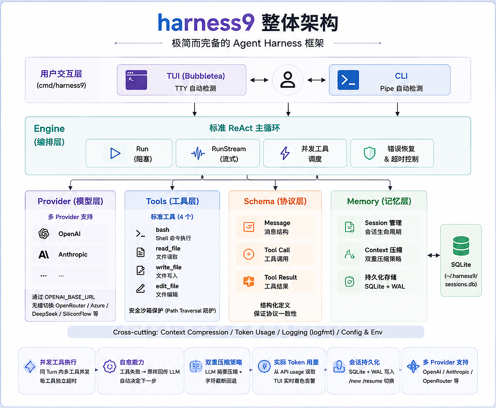
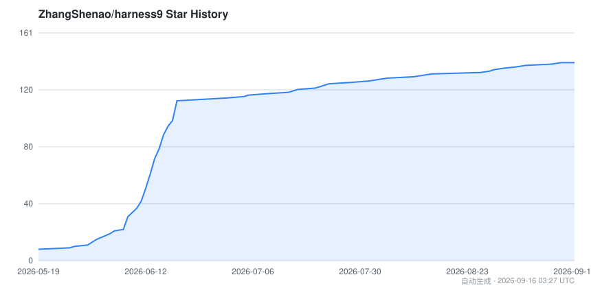

# harness9

[](LICENSE)
[](go.mod)
[](https://github.com/ZhangShenao/harness9/releases)
[](https://zhangshenao.github.io/harness9/)

**Local-First · Lightweight · Complete · Production-Ready general-purpose Agent framework, written in Go.**

English | [简体中文](README.zh-CN.md)

---


---

## Why harness9?

Most Agent frameworks are either bloated (screens of abstraction, hundreds of dependencies) or too thin (barely runs a demo). harness9 takes the middle path:

| Principle | Description |
|---|---|
| **Local-First** | All data lives on your machine (SQLite, tool_results, plans); tools run in a local Docker container. No cloud dependency, code never leaves your machine. |
| **Lightweight** | Minimal abstraction layers, straightforward code, very few direct dependencies. |
| **Complete** | Covers every core module an Agent needs to run. |
| **Production-Ready** | Error recovery, context management, timeout control, concurrent tool execution — production-grade, not a demo. |

---

## Quick Start

```bash
# Install
curl -fsSL https://raw.githubusercontent.com/ZhangShenao/harness9/master/scripts/install.sh | bash

# Configure your API key
export OPENAI_API_KEY="sk-..."

# cd into your project and launch
cd /your/project && harness9

# See all CLI flags
harness9 --help

n# Start the Mission Control Dashboard (local web GUI)nharness9 dashboard
# Print the version
harness9 --version
```

> For full install options, Anthropic/OpenRouter configuration, AGENTS.md setup, and FAQ, see the [Quick Start Guide](https://zhangshenao.github.io/harness9/docs/quick-start).

---

## Core Features

Each feature below links to its full technical writeup on the [documentation site](https://zhangshenao.github.io/harness9/).

- **[Full-screen TUI](https://zhangshenao.github.io/harness9/docs/tui)** — Bubbletea-based, welcome/conversation dual-phase, streaming output, live tool spinners, Tab-completion.
- **[Shell execution (`!` prefix)](https://zhangshenao.github.io/harness9/docs/shell-execution)** — run Bash commands straight from the input box; output is injected into the LLM context automatically.
- **[Context Engineering](https://zhangshenao.github.io/harness9/docs/context-engineering)** — SQLite-backed session persistence, LLM-summarization compaction at an 80% threshold.
- **[Long-Term Memory](https://zhangshenao.github.io/harness9/docs/long-term-memory)** — cross-session memory persisted to SQLite + FTS5, MEMORY.md materialized view injected into every prompt.
- **[Agent Skills](https://zhangshenao.github.io/harness9/docs/agent-skills)** — Progressive Disclosure: domain knowledge loaded on demand, keeping the system prompt lean.
- **[Human-in-the-Loop permissions](https://zhangshenao.github.io/harness9/docs/human-in-the-loop)** — a rule engine auto-classifies risk; only genuinely risky actions pause for approval.
- **[Planning module](https://zhangshenao.github.io/harness9/docs/planning)** — Plan Mode enforces plan-then-execute at the tool layer, with a stagnation detector.
- **[File system capabilities](https://zhangshenao.github.io/harness9/docs/file-system)** — OffloadHook moves oversized tool output to disk; FilePlanWriter persists plans as markdown.
- **[Sub-Agent delegation](https://zhangshenao.github.io/harness9/docs/sub-agent)** — delegate well-scoped subtasks to isolated sub-agents with restricted tool sets.
- **[Observability](https://zhangshenao.github.io/harness9/docs/eval)** — OpenTelemetry spans + metrics across the engine, LLM calls, and tool execution; ships with a Langfuse/Grafana/Jaeger-ready exporter.
- **[Test & Eval](https://zhangshenao.github.io/harness9/docs/eval)** — deterministic `ScriptedProvider` + assertion framework + a 16-case golden dataset gating CI.
- **[Sandbox](https://zhangshenao.github.io/harness9/docs/sandbox)** — every tool call runs inside a locked-down Docker container by default, with automatic fallback to local execution.
- **[AutoDev (`/autodev`)](https://zhangshenao.github.io/harness9/docs/autodev)** — a self-hosted development loop: clarify requirements → confirm a spec → delegate to a dev sub-agent that codes, tests, and opens the PR.
- **[MCP integration](https://zhangshenao.github.io/harness9/docs/mcp)** — connect any Model Context Protocol server via `.mcp.json`; tools appear transparently in the registry.
- **[Web search & fetch](https://zhangshenao.github.io/harness9/docs/web-search)** — `web_search`/`web_fetch` tools with SSRF hardening, no API key required.
- **[Agent OS](https://zhangshenao.github.io/harness9/docs/agent-os)** - M2 milestone: local multi-agent operating system with Mission Control, smart routing (Fast/Deep lane), parallel workers in isolated worktrees, evidence-driven verification, and a local Dashboard GUI.
- **Standard ReAct loop** — one LLM call per turn with the full tool list; concurrent tool execution and self-healing (tool errors round-trip back to the LLM as observations, triggering automatic retries).
- **Dual run modes** — blocking `Run` and streaming `RunStream`, sharing the same engine instance.

---

## Architecture Overview



---

## Core Modules

| Module | Description |
|---|---|
| **TUI** | Full-screen Bubbletea TUI: dual-phase, streaming output, spinner + precise timing, Tab completion, live token usage, shell mode. |
| **Engine** | Standard ReAct main loop, blocking + streaming, event stream (token updates, compaction, tool results, thinking deltas). |
| **Hooks** | Tool interceptors: HookRegistry (onion model) + OffloadHook + FilePlanWriter + DangerHook. |
| **Permission** | Human-in-the-loop: PermissionHook (JSON rules) + 5-option approval dialog + dynamic allowlist + hard-protected sensitive paths. |
| **Sub-Agent** | Task delegation: built-in general-purpose sub-agent, file-defined agents (`.harness9/agents/*.md`), foreground/background `task` tool, `@agent` direct invocation. |
| **Planning** | Plan Mode, TodoStore, `todo_write` tool, tool-layer permission filtering, auto-continue + stagnation detection. |
| **Memory** | Session persistence (SQLite WAL), SummarizationCompactor (default) + TokenBudgetCompactor (fallback). |
| **LTM** | Long-term memory store (SQLite + FTS5), MEMORY.md materialized view, extractor, Phase 3 seams (Provider/Embedder/Consolidator). |
| **Context** | System prompt assembly: base + AGENTS.md + skills index + todo/offload/sandbox/LTM sections. |
| **Skills** | Skill parsing, indexing, on-demand loading (`use_skill` tool). |
| **Provider** | Unified LLM interface, OpenAI/Anthropic adapters, real token usage extraction. |
| **Schema** | Shared core data types (Message, ToolCall, Usage, etc.). |
| **Tools** | Tool registry + built-ins (bash, read_file, write_file, edit_file, todo_write, memory_write/search, web_search/web_fetch). |
| **Sandbox** | Docker-level isolation: process sandboxing, per-agent containers, orphan reaping; on by default. |
| **Observability** | OpenTelemetry tracing/metrics across engine, LLM calls, and tools; noop by default. |
| **Evals** | Automated evaluation framework, golden dataset, CI quality gate. |
| **MCP** | Model Context Protocol client integration, transparent tool injection. |
| **AutoDev** | Self-hosted development loop (`/autodev` skill + dev sub-agent). |
| **Mission** | Agent OS: Mission/Plan/Task domain model, Store, CommandService (idempotent + audited). |
| **Scheduler** | Agent OS: deterministic LLM-free dispatch loop, ContractKind routing, crash recovery. |
| **Worker** | Agent OS: WorkerAdapter + git worktree + ImplementationContract. |
| **Verifier** | Agent OS: independent go build/vet/test evidence production. |
| **Integration** | Agent OS: branch merge + joint test + evidence. |
| **Router** | Agent OS: smart routing (heuristic + `/mission` prefix). |
| **Coordinator** | Agent OS: task decomposition + monitoring. |
| **Dashboard** | Agent OS: local web console (Mission CRUD + audit trail). |
| **Env** | Zero-dependency `.env` loader. |

---

## Comparison to Other Frameworks

| Framework | Origin | Difference from harness9 |
|---|---|---|
| DeepAgents | LangChain | Python, graph orchestration (LangGraph StateGraph); harness9 is an explicit Go ReAct loop with no graph engine dependency. |
| OpenHarness | HKUDS | Python, asyncio concurrency; harness9 uses goroutines natively. |
| OpenCode | Anomaly | TypeScript, delegates loop control to the Vercel AI SDK; harness9 owns its loop end to end. |
| OpenClaw | OpenClaw | TypeScript, multi-agent routing via the AI SDK; harness9 is a native Go single-agent ReAct loop. |
| HermesAgent | NousResearch | Python, ThreadPool concurrency, 3-tier context compaction; harness9 is lighter with goroutine concurrency. |
| Claude Agent SDK | Anthropic | Official SDK, Anthropic-only, black-box loop; harness9 supports multiple providers with a transparent, controllable loop. |
| OpenAI Agent SDK | OpenAI | Python, Handoffs multi-agent, depends on the OpenAI Compaction API; harness9 is native Go with its own compaction, no cloud API dependency. |

---

## Star History

[](https://github.com/ZhangShenao/harness9/stargazers)

> Since 2026-06-30 GitHub restricts stargazers API access to owners/collaborators, so third-party badges like star-history.com are broadly broken. The chart above is generated and committed daily as a static file by [`.github/workflows/star-history.yml`](.github/workflows/star-history.yml) using the repo's own `GITHUB_TOKEN`, so it doesn't depend on any third-party service's uptime.

---

## SWE-bench Benchmark

harness9's Agent capability is evaluated on [SWE-bench Lite](https://github.com/princeton-nlp/SWE-bench). See the [full benchmark methodology and run instructions](https://zhangshenao.github.io/harness9/docs/benchmark) for dataset setup, running `cmd/swebench`, and scoring results.

---

## Documentation

Full documentation, architecture write-ups, and technical blog posts live on the [documentation site](https://zhangshenao.github.io/harness9/), including the [AGENTS.md](AGENTS.md) project conventions used to drive this repo's own Agent.

---

## License

[MIT](LICENSE)
