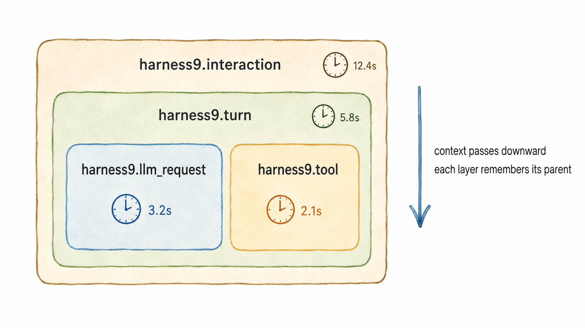
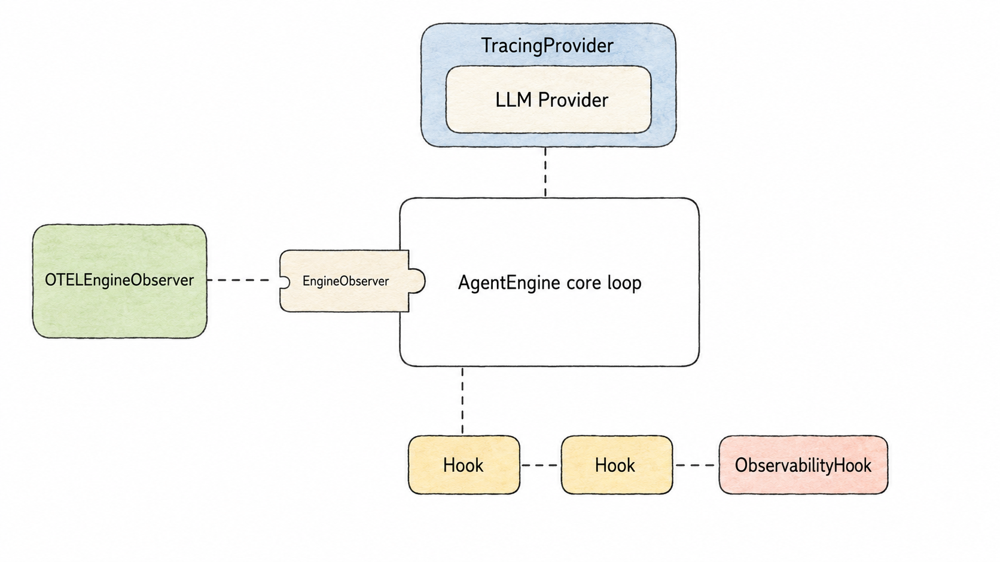
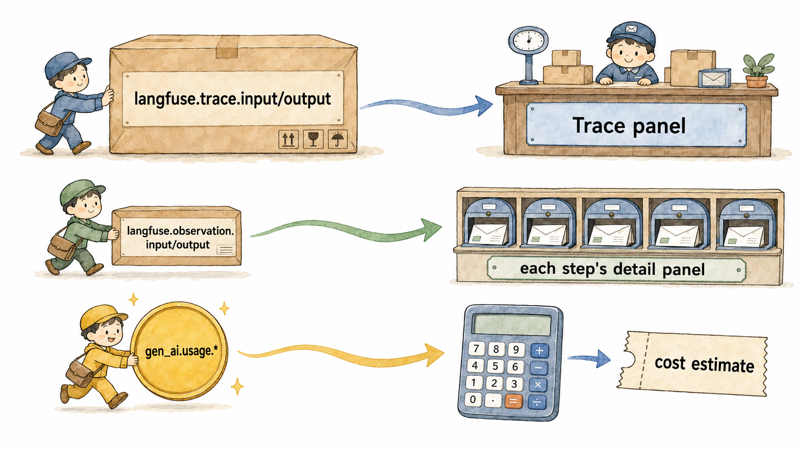
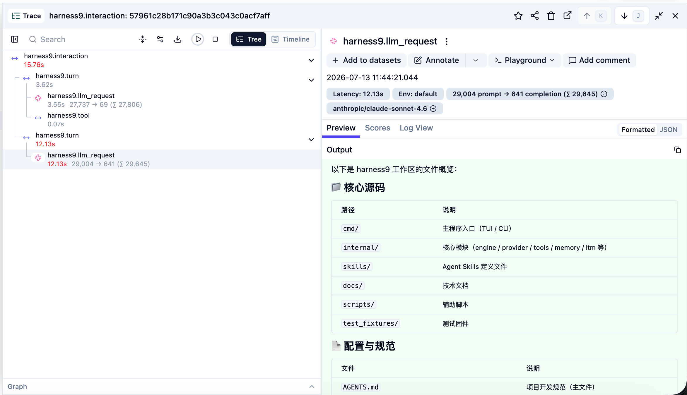

# Observability：给 Agent 装一台看清内部运转的望远镜

## 关于 harness9

harness9 是一款 Local-First、轻量级、功能完备、生产可用的通用 Go Agent 框架。

- **官网**：[https://zhangshenao.github.io/harness9/](https://zhangshenao.github.io/harness9/)
- **GitHub**：[https://github.com/ZhangShenao/harness9](https://github.com/ZhangShenao/harness9)

⭐ Star 是对开源工作最直接的支持，欢迎提 Issue 和 PR。

---

## TL;DR

- Span 树只有四层：`harness9.interaction → harness9.turn → harness9.llm_request / harness9.tool`，每一层都对应 Agent Engine 的真实执行阶段，不是硬凑的层级
- 可观测性接入靠的是三个已经存在的接口 ———— `EngineObserver`、`LLMProvider`、`ToolHook` ———— 核心引擎代码一行都没改
- 6 个 Metrics 分两类：耗时用 Histogram（看分布），计数用 Counter（看总量），工具相关的两个还带上了"工具名 + 成功/失败"这两个标签，方便按维度筛选
- Langfuse 是一个专门给 LLM 应用做可观测的平台，接上它之后，每次 Agent 运行会自动变成一条能展开查看的时间线，还能自动算出这次对话花了多少钱
- Langfuse 的属性名是有讲究的：写对名字数据才会显示在界面上，名字如果错了数据照样可以上报，但界面上什么都看不到

## 本文你将学到

- Span 四层嵌套分别对应引擎运行的哪几个阶段，父子关系是怎么串起来的
- 三个已有接口是怎么被复用来承载可观测性逻辑的，为什么这样做比直接改核心代码更好
- 6 个 Metrics 怎么分类、每个类型该用 Counter 还是 Histogram
- Langfuse 到底是什么、解决了什么问题，harness9 为什么选它
- 属性名怎么写 Langfuse 才认得出来，token 费用是怎么被自动算出来的

---

## 先看一眼 Trace 长啥样

harness9 跑一次 Agent 任务，接入 Langfuse 之后，看到的是这样一棵树：

```
harness9.interaction   [session.id="abc123"]
│
├── harness9.turn   [第 1 轮]
│   ├── harness9.llm_request   [调用了一次 LLM，用了多少 token]
│   ├── harness9.tool   [bash 执行，成功]
│   └── harness9.tool   [read_file 执行，成功]
│
└── harness9.turn   [第 2 轮]
    └── harness9.llm_request   [...]
```

这棵树是怎么长出来的、每一层是谁画的、Langfuse 又是怎么把它渲染成一条能点开看的时间线 ———— 这是本文要讲的全部内容。

---

## Span 树的层级

把 Agent 的一次运行拆开看，天然就只有四个阶段：一次完整的对话、对话里的每一轮、每一轮里调用的那次 LLM、每一轮里执行的每个工具。harness9 的 Span 层级就是照着这四个阶段画的，一层不多一层不少：

| Span | 对应引擎的哪个阶段 |
|------|------------------|
| `harness9.interaction` | 用户发一句话到 Agent 最终给出结果，整个过程 |
| `harness9.turn` | ReAct Loop 里的一轮：一次 LLM 调用 + 这一轮触发的工具执行 |
| `harness9.llm_request` | 具体的一次 LLM API 调用 |
| `harness9.tool` | 具体的一次工具执行 |

再往下拆就是 HTTP 请求细节了，没必要拆；`interaction` 和 `turn` 合并的话，"哪一轮变慢了"这个最常被问到的问题就没法回答了。四层刚好卡在"有意义"和"没必要"之间。

这四层 Span 分别由三个不同的组件在不同时间创建：`interaction` 和 `turn` 由一个叫 `OTELEngineObserver` 的东西在循环的开始/结束处创建，`llm_request` 由包装了 LLM 调用的 `TracingProvider` 创建，`tool` 由工具执行前后的 `ObservabilityHook` 创建。它们能拼成一棵完整的树，靠的是 Go 里的 `context.Context` 一路往下传 ———— 上一层创建 Span 时把它记进 ctx，下一层创建 Span 时从 ctx 里发现"上面已经有一个 Span 了"，就自动认它做父节点。

唯一需要小心的地方是：harness9 引擎中间还夹着"压缩历史消息"、"加载会话"这类逻辑，它们可能会不小心替换掉 ctx。为了防止这种情况把父子关系搞断，`OTELEngineObserver` 在传递 ctx 的同时，多留了一份备份，下一层创建 Span 前会先检查备份还在不在，不在就用备份补回来。说白了就是"关键信息多存一份，防止半路弄丢"。



---

## 无侵入式可观测

给系统加可观测性，最偷懒的做法是在每个关键位置插一段"打点"代码 ———— LLM 调用前后插一段，工具执行前后插一段。问题是插的地方一多，核心逻辑就被这些和业务无关的代码淹没了。

harness9 的做法是不新增插桩点，而是找三个**本来就存在**的接口，把可观测性挂上去。

**第一条路径**：引擎在运行的几个关键节点（开始、每一轮开始、每一轮结束、结束）会通知一个叫 `EngineObserver` 的监听者。这个接口本来就是给"想知道引擎在干什么"的外部代码准备的，`OTELEngineObserver` 只是实现了它：

```go
type EngineObserver interface {
	OnInteractionStart(ctx context.Context, sessionID, prompt string) context.Context
	OnInteractionEnd(ctx context.Context, turns int, err error)
	OnTurnStart(ctx context.Context, turn int) context.Context
	OnTurnEnd(ctx context.Context, turn int, hasToolCalls bool)
}
```

引擎不知道监听者是谁，甚至不知道有没有监听者 ———— 没配置的话就用一个什么都不做的空实现顶替。

**第二条路径**：LLM 调用走的是一个叫 `LLMProvider` 的接口，`TracingProvider` 直接实现同一个接口，内部真正干活的还是原来那个 Provider，它只是在外面套了一层壳，调用前后记一下 Span：

```go
func (p *TracingProvider) Generate(ctx context.Context, messages []schema.Message, tools []schema.ToolDefinition) (*schema.Message, *schema.Usage, error) {
	ctx, span := p.tracer.Start(ctx, SpanLLMRequest)
	defer span.End()
	return p.inner.Generate(ctx, messages, tools) // 真正干活的还是原来那个 Provider
}
```

引擎那边完全感觉不到差别 ———— 它拿到的还是同一个接口类型，只是运行时这个接口背后换了个实现。

**第三条路径**：工具执行前后本来就有一套叫 `ToolHook` 的拦截机制，专门给"危险命令拦截"、"权限审批"这类需要**改变**执行结果的场景用的。`ObservabilityHook` 也实现了这个接口，但它从不拦截、不修改，只是在旁边看着记录：

```go
func (h *ObservabilityHook) BeforeExecute(ctx context.Context, tc schema.ToolCall) (context.Context, hooks.HookDecision, error) {
	ctx, span := h.tracer.Start(ctx, SpanToolExecution, ...)
	return ctx, hooks.Allow(), nil // 永远放行，只看不管
}
```

三条路径的共同点是：可观测性要用到的每一个"钩子"，harness9 里早就有一个为了别的目的而存在的接口在那个位置等着。挂上去就行，不用再开一个新口子。



---

## 定义核心 Metric

Span 记的是"这一次发生了什么、花了多久"，Metrics 记的是"长期看趋势怎么样" ———— 过去一小时 token 花得多不多，工具最近失败率是不是变高了。harness9 定义了 6 个 Metrics：

| 指标 | 类型 | 说明 |
|------|------|------|
| `harness9.llm.request.duration` | Histogram | LLM 单次调用耗时 |
| `harness9.llm.tokens.input` | Counter | 累计输入 token |
| `harness9.llm.tokens.output` | Counter | 累计输出 token |
| `harness9.tool.calls.total` | Counter | 工具调用次数 |
| `harness9.tool.execution.duration` | Histogram | 工具执行耗时 |
| `harness9.agent.turns.total` | Counter | Agent 总轮数 |

类型选择很直接：**看耗时用 Histogram，看总量用 Counter**。耗时这种数据只看平均值没意义 ———— 大部分请求 2 秒完成，但偶尔一次 20 秒，这两个信息都得留住，Histogram 能告诉你分布长什么样。Token 消耗、调用次数这种只增不减的数字，Counter 一个累加器就够了。

工具相关的两个指标，额外挂了"工具名"和"成功还是失败"两个标签：

```go
attrSet := attribute.NewSet(
	attribute.String(AttrToolName, tc.Name),
	attribute.String("tool.status", status),
)
h.toolDuration.Record(ctx, elapsed, metric.WithAttributeSet(attrSet))
h.toolCallsTotal.Add(ctx, 1, metric.WithAttributeSet(attrSet))
```

没有这两个标签，"工具总共调用了多少次"只是一个孤零零的数字，看不出是 `bash` 慢还是 `read_file` 慢，也看不出最近哪个工具的失败率在悄悄上升。加上标签之后，这个数字就能按维度拆开来看了。

---

## 为什么选择 Langfuse？

Langfuse 是一个专门给 LLM 应用做可观测的开源平台。普通的监控平台（Grafana、Jaeger）是给传统后端服务设计的，看的是 HTTP 请求耗时、数据库查询次数这类指标；Langfuse 是照着"LLM 应用"这个场景专门设计的，天生就懂"一次对话"、"一次模型调用"、"用了多少 token"这些概念。

它解决的核心问题有两个：第一，把一次 Agent 运行变成一条可以展开、可以点进去看细节的时间线 ———— 哪一步调用了 LLM、传了什么消息、模型回了什么、每个工具执行花了多久，全部摆在一张图上；第二，自动算钱 ———— 每次 LLM 调用花了多少 input token、多少 output token，Langfuse 直接按模型定价换算出这次调用大概花了多少钱，不用自己维护一张价目表去手动计算。

harness9 选择接入 Langfuse，是因为它原生支持 OpenTelemetry ———— 也就是说，harness9 只需要按标准协议把 Span 和 Metrics 发出去，不需要为 Langfuse 单独写一套 SDK 或者适配层。同一套 OTEL 数据，理论上换个地址也能发给 Grafana、Jaeger 这些平台，只是 Langfuse 对 LLM 场景的界面展示做得更贴切。

---

## Langfuse 接入细节

OTEL 本身只规定"有 Span 这个东西、Span 上能挂属性"，属性叫什么名字、Langfuse 拿它来干什么，完全是两边私下的约定。harness9 往 Span 上报属性时，用的是 Langfuse 认识的名字。

道理很简单，可以打个比方：这就像寄快递要在包裹上贴清楚"收件人"和"寄件人"，贴对了地方，分拣中心才知道往哪儿送；名字贴错了，包裹照样能到，但没人知道该往哪儿摆。

具体来说，"一次完整对话"（也就是最外层的 `interaction`）的输入输出，要写成 `langfuse.trace.input` / `langfuse.trace.output`；而"对话里的某一步"（比如一次 LLM 调用、一次工具执行）的输入输出，要写成 `langfuse.observation.input` / `langfuse.observation.output`。两套名字分别对应 Langfuse 界面上"整个 Trace 的输入输出"和"每个子节点各自的输入输出"这两块展示区域。如果图省事都写成不带 `trace`/`observation` 的 `langfuse.input`/`langfuse.output`，Langfuse 会把这些属性当成普通元数据存起来，界面上该显示内容的地方就是一片空白。

Token 费用的自动计算靠的是另一套约定好的名字 ———— `gen_ai.usage.input_tokens` 和 `gen_ai.usage.output_tokens`，这是 OTEL 官方给"大模型调用"这类场景定的标准名字。harness9 只要把每次调用实际消耗的 token 数字写进这两个属性：

```go
span.SetAttributes(
	attribute.Int(AttrGenAIInputTokens, usage.InputTokens),
	attribute.Int(AttrGenAIOutputTokens, usage.OutputTokens),
)
```

Langfuse 看到这两个属性名，就知道该按对应模型的价目表算一遍费用，展示成"25,269 prompt → 1,027 completion"这样的费用估算，不用 harness9 自己维护任何定价逻辑。



最终展示在 Langfuse 上的 Trace 看板长这样：


---

## 结语

harness9 的可观测性模块最值得记住的不是它接了 OTEL、接了 Langfuse，而是它证明了一件事：给系统装上"看清内部"的能力，不一定要在系统内部埋满探针。找到已经存在的边界 ———— 一个监听接口、一层装饰器、一个钩子 ———— 让观测者挂在边界上，核心逻辑可以永远不知道自己正在被观测。如果你的系统里还没有这样的边界，那么在加可观测性之前，或许应该先问一句：这一层抽象，是不是本来就该存在？

---

