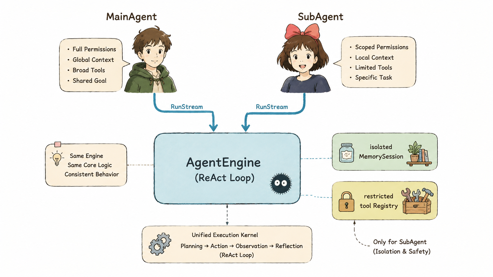
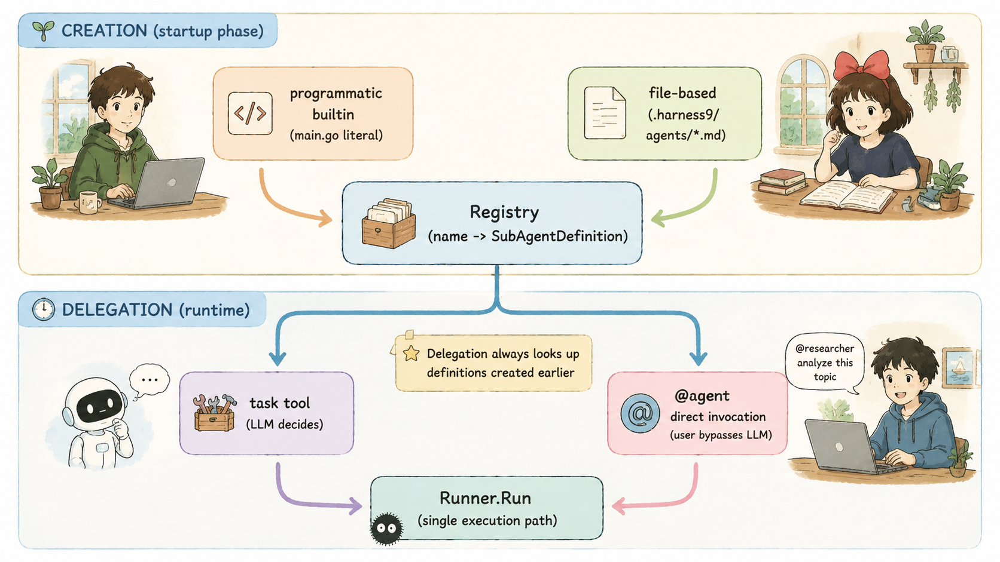
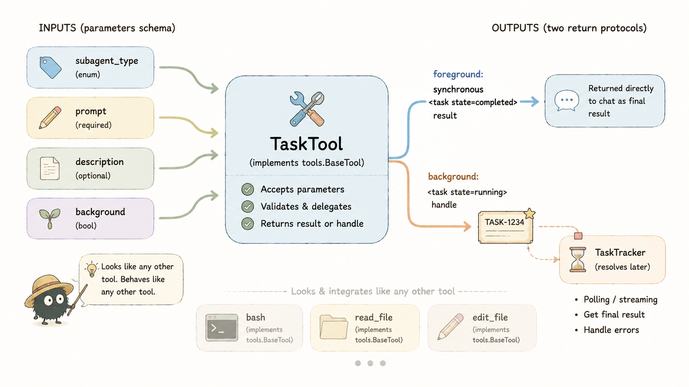
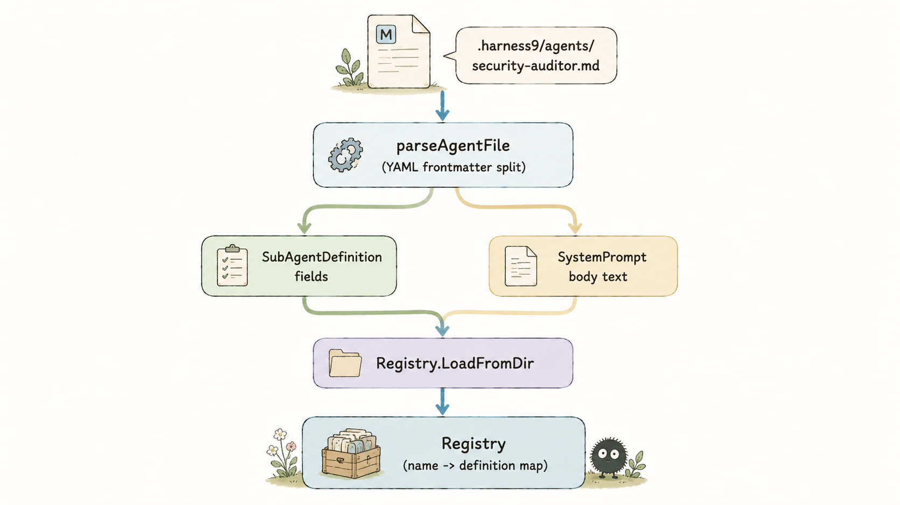
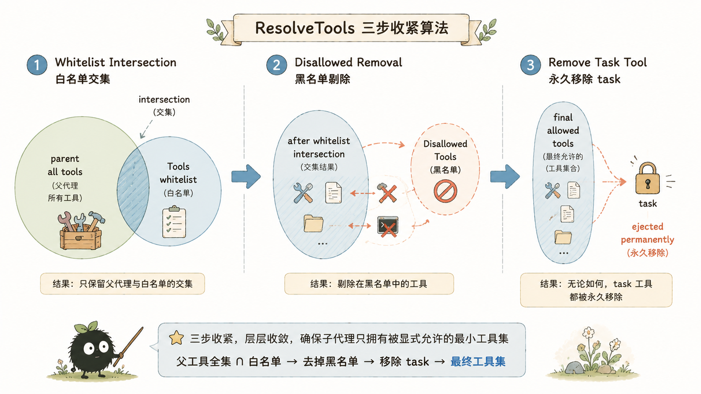
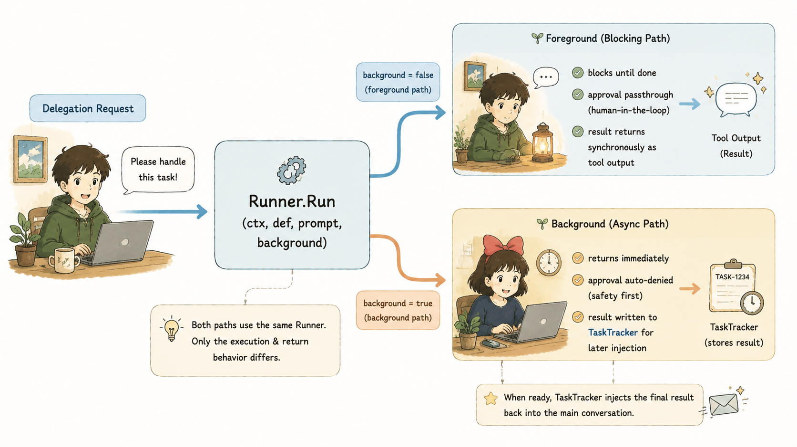
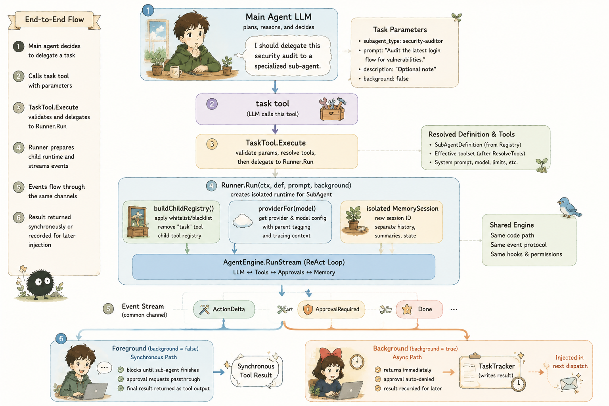

# SubAgent：harness9 如何让主代理把任务外包出去

## 关于 harness9

harness9 是一款 Local-First、轻量级、功能完备、生产可用的通用 Go Agent 框架。

- **官网**：[https://zhangshenao.github.io/harness9/](https://zhangshenao.github.io/harness9/)
- **GitHub**：[https://github.com/ZhangShenao/harness9](https://github.com/ZhangShenao/harness9)

⭐ Star 是对开源工作最直接的支持，欢迎提 Issue 和 PR。

---

## TL;DR

- SubAgent 不是新组件，而是运行在隔离 Session 上的普通 `engine.AgentEngine` 实例，复用 `RunStream` 流水线，不改 `runLoop` 一行代码
- 创建 SubAgent 只有两条路：内置编程式注册（`general-purpose`）和 `.harness9/agents/*.md` 文件式定义，二者统一进 `Registry`
- 委派 SubAgent 也只有两条路：主 LLM 通过 `task` 工具基于语义自主决策，或用户用 `@agent` 直接绕开 LLM 前台直跑
- 委派入口 `task` 就是个普通 `tools.BaseTool`，对 Engine 完全透明，和 bash、read_file 走同一条调度路径，没有专属的"委派协议"
- `ResolveTools` 用"白名单∩全集 - 黑名单 - task"三步收紧权限，`task` 工具被硬编码永久移除，从根上禁止递归委派，即 SubAgent 无法再创建      SubAgent
- SubAgent 看不到 MainAgent 的对话历史和 System Prompt，`prompt` 参数是唯一信息通道，独立 `MemorySession` 保证上下文零泄漏
- 前台执行复用父调用方 ctx 的审批通道，后台执行审批一律 fail-closed 拒绝，两条路径共享同一个 `Runner.Run` 实现
- `TaskTracker` 用 `sync.Mutex` 替代 channel 管后台任务状态，从根上规避 send-on-closed-channel 风险

## 本文你将学到

- 读完开篇就能建立起"如何创建SubAgent"和"如何委派SubAgent"的完整心智模型，不用读到文末才拼出全貌
- 看清 `task` 工具的参数 schema 怎么设计、`Execute` 怎么在前台阻塞与后台立即返回之间切换，以及为什么委派被做成一个普通 tool 而非新协议
- 看清 `ResolveTools` 如何保证委派链上权限只能收紧、不能扩张
- 掌握 Runner 中前台/后台两种 execCtx 派生策略，以及为什么要绕开父工具的 60s 超时
- 理解 TaskTracker 为什么放弃 channel 转而用锁保护的内存缓冲

---

## 为什么要有 SubAgent？

Agent 的上下文窗口是极度稀缺的资源。一次多步骤探索——读十个文件、跑五次 bash、反复试错——中间过程全塞进主对话历史，既污染后续推理质量，也吃掉 token 预算。

主流的 Harness 框架都给出同一个解决方案：把边界清晰的子任务整体外包出去，只拿回一份简洁结论。harness9 完整继承了这个内核，但工程上做了个关键决定——**SubAgent 不是新造的执行器，它就是与主 Agent 复用的同一套 `engine.AgentEngine`**。

```go
sub := engine.NewAgentEngine(p, childReg, r.workDir, opts...)
stream, err := sub.RunStream(execCtx, prompt)
```

`Runner.Run` 里这两行就是 SubAgent 的全部执行内核。没有单独的 SubAgent Loop，没有专门调度器。SubAgent 和 MainAgent 所执行的的是同一个标准 ReAct 循环，区别只在工具集更窄、Session 更干净、Context 派生方式不同。




---

## 创建与委派：两个心智模型

先把两件容易混的事分清楚：**创建一个 SubAgent **和**委派一次任务**是两条独立路径，一个发生在启动阶段，一个发生在运行时。

### 创建：SubAgent 从哪里来

harness9 只认两种"出身"，最终都汇入同一个 `Registry`：

| 创建方式 | 载体 | 何时注册 | 适用场景 |
|---------|------|---------|---------|
| 编程式内置 | `main.go` 里的 `SubAgentDefinition{}` 字面量 | 启动阶段 `subAgentReg.Register(...)` | 内置 `general-purpose`，通用任务子代理 |
| 文件式定义 | `.harness9/agents/*.md`（YAML frontmatter + 正文） | 启动阶段 `Registry.LoadFromDir` 扫描加载 | 项目侧自定义专门角色（安全审计、文档撰写等） |

两种方式殊途同归，都是构造一个 `SubAgentDefinition` 塞进 `Registry.defs` 这张 map。`Registry` 本身很简单：

```go
type Registry struct {
    defs map[string]SubAgentDefinition
}

func (r *Registry) Register(def SubAgentDefinition) error { /* Validate + 去重 */ }
func (r *Registry) Get(name string) (SubAgentDefinition, bool)
func (r *Registry) List() []SubAgentDefinition
```

约定是启动阶段一次性注册、运行期只读，跟 `tools.Registry` 的惯例一致——不加锁，因为运行时没有并发写入。文件式定义还有个覆盖规则：同名文件定义会覆盖编程式定义（记日志，不报错），所以想改内置行为，写个 `.harness9/agents/general-purpose.md` 就行，不用碰 Go 代码。

创建阶段只回答一个问题：整个系统内部有哪些 SubAgent 类型，各自的权限边界和角色设定是什么。不涉及具体任务执行。

### 委派：一次任务如何被派发出去

创建完成后，运行时唯一要回答的是：这次任务该不该外包，外包给谁，用什么方式。harness9 给了两条路：

| 委派方式 | 触发方 | 是否经过主 LLM 决策 | 执行模式 |
|---------|--------|---------------------|---------|
| `task` 工具 | 主 LLM 的 ToolCall | 是——LLM 自主选择 `subagent_type` 与 `prompt` | 前台阻塞（默认）或后台异步（`background=true`） |
| `@agent` 直跑 | 用户输入框 `@agent-name 任务描述` | 否——完全绕开 LLM 工具决策 | 仅前台阻塞 |

`task` 工具是委派系统对主 LLM 暴露的唯一接口，既是发起委派的入口，也是选前台还是后台的开关。`@agent` 是给人类留的旁路，用于"我现在就要看到这个SubAgent 实时输出"的场景，代价是只支持前台。

两条路最终都会走到同一个 `Runner.Run`——委派的"决策"可以有两种发起方式，但"执行"只有一套实现。




---

## task 工具：委派入口本身的设计

委派路径里主 LLM 唯一能碰到的接口只有一个——`task` 工具。`TaskTool` 定义在 `internal/subagent/task_tool.go`，是整个 SubAgent Delegation 对外暴露的全部能力，值得在深入 Runner 内部机制之前先讲清楚。

### 参数 schema：四个字段划清委派的边界

`Definition()` 每次调用都**动态生成**，把当前注册表里所有 SubAgent 的 `Name` 塞进 `subagent_type` 的枚举值：

```go
func (t *TaskTool) Definition() schema.ToolDefinition {
    defs := t.reg.List()
    names := make([]string, 0, len(defs))
    var sb strings.Builder
    sb.WriteString("把一个边界清晰的任务委派给专门的SubAgent执行。SubAgent拥有独立上下文与受限工具集。\n可用SubAgent：\n")
    for _, d := range defs {
        names = append(names, d.Name)
        fmt.Fprintf(&sb, "- %s: %s\n", d.Name, d.Description)
    }
    return schema.ToolDefinition{
        Name:        "task",
        Description: sb.String(),
        InputSchema: map[string]any{
            "type": "object",
            "properties": map[string]any{
                "subagent_type": map[string]any{
                    "type": "string", "enum": names,
                    "description": "要调用的SubAgent类型名称",
                },
                "description": map[string]any{
                    "type": "string", "description": "任务的简短标题（3-5 词，用于 UI 展示）",
                },
                "prompt": map[string]any{
                    "type":        "string",
                    "description": "传给SubAgent的完整任务描述。SubAgent看不到主对话历史，所有必要信息（文件路径、背景、要求）都要写在这里。",
                },
                "background": map[string]any{
                    "type":        "boolean",
                    "description": "是否后台异步运行。true 时立即返回，结果稍后注入；false（默认）阻塞直到完成。",
                },
            },
            "required": []string{"subagent_type", "prompt"},
        },
    }
}
```

四个参数各司其职，没一个多余：

- `subagent_type` 是唯一必填枚举，`enum` 数组直接从 `Registry.List()` 现算，所以永远和实际注册的SubAgent保持同步——新增一个 `.harness9/agents/*.md` 文件不用改任何 schema 代码。这也是"创建"和"委派"两个阶段的直接接口：`Registry` 里有什么，`task` 就能委派给什么。
- `prompt` 是唯一必填的自由文本参数，是父子之间的唯一信息通道，description 里直接写明"SubAgent 看不到主对话历史"——把架构约束翻译成 LLM 能懂的提示词。
- `description` 只是 UI 装饰字段，展示用，不参与执行逻辑，跟机制字段分得很干净。
- `background` 默认 `false`（阻塞），用于控制 SubAgent 的执行模式（前台/后台）

`Description` 本身也有讲究：不是静态字符串，而是把所有已注册 SubAgent 的 `Name` 和 `Description` 拼进工具描述。LLM 决定"该不该委派、委派给谁"全靠这段动态拼接的文本，没有额外的检索或推荐机制。

### Execute：一个函数里装下两种执行语义

`Execute` 骨架很短，但一个分支决定了两种完全不同的执行路径：

```go
func (t *TaskTool) Execute(ctx context.Context, args json.RawMessage) (string, error) {
    var a taskArgs
    if err := json.Unmarshal(args, &a); err != nil {
        return "", fmt.Errorf("参数解析失败: %w", err)
    }
    if a.SubAgentType == "" {
        return "", fmt.Errorf("subagent_type 不能为空")
    }
    if a.Prompt == "" {
        return "", fmt.Errorf("prompt 不能为空")
    }
    def, ok := t.reg.Get(a.SubAgentType)
    if !ok {
        return "", fmt.Errorf("未知SubAgent类型 %q，可用: %s", a.SubAgentType, t.agentNames())
    }

    if a.Background {
        taskID := t.tracker.Start(def.Name, a.Prompt)
        go func() {
            defer func() {
                if rec := recover(); rec != nil {
                    t.tracker.Finish(taskID, fmt.Sprintf("SubAgent后台执行 panic: %v", rec), true)
                }
            }()
            sink := func(u schema.SubAgentUpdate) { t.tracker.AppendLog(taskID, u) }
            bgCtx := hooks.WithSubAgentProgress(context.Background(), sink)
            res, err := t.runner.Run(bgCtx, def, a.Prompt, true)
            if err != nil {
                t.tracker.Finish(taskID, err.Error(), true)
            } else {
                t.tracker.Finish(taskID, res.FinalText, false)
            }
        }()
        return fmt.Sprintf(`<task id=%q state="running"/>`, taskID), nil
    }

    res, err := t.runner.Run(ctx, def, a.Prompt, false)
    if err != nil {
        return fmt.Sprintf(`<task state="error">%s</task>`, err.Error()), nil
    }
    return fmt.Sprintf(`<task state="completed"><task_result>%s</task_result></task>`, res.FinalText), nil
}
```

前半段是常规参数校验和查表。比较重要的是分支 `if a.Background`：

- **前台执行**：直接调用 `t.runner.Run(ctx, def, a.Prompt, false)`，同步等结果，把 `FinalText` 包进 XML 风格字符串直接返回。`Execute` 是 Engine 同步调用的普通函数，走这条分支意味着当前 Turn 会一直卡在这，直到 SubAgent 跑完。
- **后台执行**：先 `t.tracker.Start` 拿个 `taskID`，开一个 goroutine 异步跑，`Execute` 自己**立即返回**一个 `state="running"` 的占位结果。SubAgent 真实执行完全脱离了这次调用的生命周期。

后台分支里还有个防御：`recover()` 兜住 goroutine 内的 panic，转成 `Finish(taskID, ..., true)` 写回 tracker，而不是让它直接崩掉进程——这是一个脱离主调用栈独立运行的 goroutine，外层没人等着捕获它的 panic。

### 为什么是一个普通 tool，而不是新协议

`TaskTool` 唯一的特殊之处，是它实现了 `tools.BaseTool` 接口——`Name()` / `Definition()` / `Execute()`，跟 `bash`、`read_file`、`write_file` 长得一模一样。这个决定看着朴素，其实是整个委派系统能零侵入接入 Engine 的关键：

- Engine 的主循环、Hook 链、超时控制、并发调度、审批弹窗、TUI 渲染，全都是围绕"工具调用"这一个抽象写的。委派要复用这套基建，最省事的办法就是让它长得像一次工具调用。
- `HookRegistry` 不用为 `task` 写任何特殊分支。`danger_hook`、`offload_hook` 该怎么包 `bash` 就怎么包 `task`——`task` 唯一被特殊对待的地方在SubAgent内部（`denyTaskHook` 拒绝再调用它），对父代理这层它就是个普通工具。
- LLM 侧也不用学新协议。模型早就会发 ToolCall，把委派做成工具调用就不用额外的 prompt 工程去教它一种新交互模式——调用 `task` 和调用 `bash` 走的是同一个认知路径。

一句话：**把委派做成 tool，是用一个已经验证过的抽象（工具调用）去承载新能力（SubAgent 委派），而不是另起炉灶发明新抽象**。这跟 harness9"最小化抽象层"的理念完全一致。

### 返回值设计：两种终态，一种协议

`task` 工具的返回值走一套轻量 XML 风格标记，三种终态：

```
<task state="completed"><task_result>...</task_result></task>   // 前台成功
<task state="error">...</task_result></task>                     // 前台失败
<task id="task-general-purpose-1" state="running"/>               // 后台立即返回
```

前台两种终态都**同步**塞进这次工具调用的 Output，父代理下一轮立即能读到；后台的 `running` 只是个句柄，真正的结果不走这次 `Execute` 返回，得等 `TaskTracker.Finish` 之后，在下一次 `dispatch()` 前通过 `DrainCompleted()` 排空、拼进 LLM 的 prompt 前缀（并发细节见后面 TaskTracker 一节）。

这个设计把"工具调用必须同步返回字符串"这个硬约束，和"后台任务本质异步"这个语义需求解耦开了——`task` 永远同步返回，但返回内容要么是最终结果，要么是指向未来结果的指针（`taskID`），指针怎么兑现全交给 `TaskTracker` 处理。这也是为什么 `TaskTool` 要同时持有 `Registry`、`Runner`、`TaskTracker` 三个协作者——`Execute` 本身只是一次编排，不持有状态。




---

## general-purpose：内置的通用 SubAgent

讲完委派入口，回头看创建阶段的第一种方式——编程式内置。harness9 内置一个 `general-purpose` 通用 SubAgent，对标 Claude Code 和 DeepAgents 的同名能力——没有更专门的 SubAgent 时，它是默认委派目标。

它的定义几乎全是空值：

```go
subAgentReg.Register(subagent.SubAgentDefinition{
    Name:         "general-purpose",
    Description:  "通用SubAgent，处理需要兼顾探索与修改、复杂推理或多步依赖的任务...",
    SystemPrompt: generalPurposeSystemPrompt,
    Source:       "builtin", // Tools/Model/MaxTurns 均留空
})
```

`Tools` 留空 = 继承父代理**全部**可用工具；`Model` 留空 = 继承父代理模型；`MaxTurns` 留空 = 继承引擎默认轮数。它不缩小能力边界，只缩小**上下文范围**——委派给它的价值不在限制它能做什么，而在把冗长中间过程隔离在子会话里，只回传一份结论。

当需要特定领域的 SubAgent （安全审计、文档撰写）时，harness9 的建议是走文件式定义，别往内核里堆更多编程式内置——保持核心精简，专门化交给项目侧。

---

## 文件式定义：一个 Markdown 文件就是一个新代理

创建阶段的第二种方式。在工作目录建个 `.harness9/agents/security-auditor.md`，harness9 启动时自动扫描加载：

```markdown
---
name: security-auditor
description: 安全审计专家。对涉及认证、鉴权、输入校验的代码变更后使用。
tools: read_file, bash
disallowed_tools: write_file, edit_file
model: openai/gpt-4o
max_turns: 30
skills: security-review
---

你是一名应用安全工程师，专注于识别代码中的安全漏洞。
审查时按优先级输出：严重 > 高危 > 中危 > 低危，每条附上 CWE 编号与修复建议。
不要修改文件，只输出审查报告。
```

解析逻辑在 `parseAgentFile` 里，是个刻意做得很朴素的手写解析器——按 `---\n` 定界符切出 frontmatter，逐行按 `:` 切分 key/value，列表字段按逗号拆分：

```go
func parseAgentFile(content string) (SubAgentDefinition, error) {
    const delim = "---\n"
    if !strings.HasPrefix(content, delim) {
        return SubAgentDefinition{}, fmt.Errorf("缺少 frontmatter 起始分隔符")
    }
    // ... 定位闭合分隔符，body 作为 SystemPrompt
    for _, line := range strings.Split(fm, "\n") {
        k, v, ok := strings.Cut(line, ":")
        // ...
    }
}
```

没引入 YAML 库，因为 frontmatter 字段集合固定又扁平，手写解析比引入 `gopkg.in/yaml.v3` 更符合"最小化抽象层"的原则。`LoadFromDir` 扫描时，目录不存在就静默返回 nil——零配置也能跑；单文件解析失败只记 warning 不中断；文件定义覆盖同名编程式定义（记日志），所以项目可以直接用文件定义盖掉内置的 `general-purpose`。




---

## ResolveTools：权限只能收紧，不能扩张

接下来进深入实现——委派发生之后，Runner 具体做了什么。先看权限计算，这是整个系统里最关键的一段代码。SubAgent 的工具集不是随便声明的，是个确定性的三步收窄算法：

```go
func (d SubAgentDefinition) ResolveTools(all []string) []string {
    allowed := make(map[string]bool, len(all))
    for _, t := range all {
        allowed[t] = true
    }

    var base []string
    if len(d.Tools) > 0 {
        for _, t := range d.Tools {
            if allowed[t] {
                base = append(base, t)
            }
        }
    } else {
        base = append(base, all...)
    }

    denied := map[string]bool{"task": true}
    for _, t := range d.DisallowedTools {
        denied[t] = true
    }

    result := make([]string, 0, len(base))
    for _, t := range base {
        if !denied[t] {
            result = append(result, t)
        }
    }
    return result
}
```

三步走：`Tools` 白名单与父全集取交集（留空则取全集）；减去 `DisallowedTools` 黑名单；`task` 永远被强制塞进 `denied` map，不管定义文件里写没写。

这个函数的输入是 `all []string`——父代理的可用工具集，所以 **SubAgent 的权限永远不会越过 MainAgent，并且 SubAgent 不允许再递归委派。**，没有任何方式能让 SubAgent 拿到父代理都没有的工具。交集运算天然不会扩大集合，这就是"委派链单向收紧"的数学基础。

`task` 的处理是双重防御。`ResolveTools` 硬编码移除是第一层；`Runner.buildChildRegistry` 又额外包了个 `denyTaskHook`：

```go
type denyTaskHook struct{}

func (denyTaskHook) BeforeExecute(ctx context.Context, tc schema.ToolCall) (context.Context, hooks.HookDecision, error) {
    if tc.Name == "task" {
        return ctx, hooks.Deny("SubAgent不允许再派生SubAgent"), nil
    }
    return ctx, hooks.Allow(), nil
}
```

这里有个思路值得记：就算未来某次重构不小心让 `task` 混进了 SubAgent 的工具注册表，这个 Hook 还能在执行前拦下来。禁止递归不靠一处检查兜底，靠两处独立机制叠加。




---

## 上下文完全隔离：prompt 是唯一的信息通道

SubAgent 不是主对话的延伸分支，是全新的会话：

```go
childID := fmt.Sprintf("subagent-%s", def.Name)
childSession := memory.NewMemorySession(childID)
```

`NewMemorySession` 是纯内存 Session，不带父代理的对话历史，也不含父代理的 system prompt。SubAgent 的 system prompt 由 `promptBuilder` 单独组装：

```go
func (b *promptBuilder) Build() string {
    var sb strings.Builder
    sb.WriteString(b.systemPrompt)
    fmt.Fprintf(&sb, "\n\n工作目录：%s", b.workDir)
    if b.loader != nil {
        for _, name := range b.skills {
            body, err := b.loader(name)
            if err != nil || strings.TrimSpace(body) == "" {
                continue
            }
            fmt.Fprintf(&sb, "\n\n## 预加载技能：%s\n\n%s", name, body)
        }
    }
    // ... Sandbox 环境说明（可选）
    return sb.String()
}
```

`promptBuilder` 通过结构类型隐式满足 `engine.PromptBuilder` 接口，不用 `import engine`——这是 harness9 一贯避免循环依赖的手法（subagent 依赖 engine，engine 不反向依赖 subagent）。

说白了，**SubAgent 启动时对父对话一无所知。`task` 工具的 `prompt` 参数是父子之间唯一的信息通道**——文件路径、背景信息、任务要求，全得靠 LLM 显式写进 prompt 字符串。这不是遗漏，是刻意的约束：**上下文隔离的价值就在于强制主 LLM 把任务描述清楚，而不是指望"SubAgent反正能看到全部历史**。

---


## 前台执行 vs 后台执行

`task` 工具支持 `background` 参数，前台阻塞、后台异步，但两条路径底层跑的是同一个 `Runner.Run(ctx, def, prompt, background)`——`background` 只是个开关，决定审批策略和结果交付方式，不是两套独立实现。

前台执行时，审批请求透传父代理的审批通道：

```go
case engine.EventApprovalRequired:
    req, ok := evt.Data.(engine.ApprovalRequest)
    if !ok {
        continue
    }
    if background || parentApproval == nil {
        req.ResponseCh <- hooks.ApprovalResponse{Approved: false,
            Feedback: "SubAgent无可用审批通道，已自动拒绝"}
    } else {
        req.ResponseCh <- parentApproval(execCtx, req.ToolCall, req.Reason, req.RiskLevel)
    }
```

后台执行没有 TUI 通道可弹审批对话框，harness9 的策略是 **fail-closed**——一律自动拒绝，不自动放行。这是个明确的安全取舍：**宁可后台任务因权限不足失败，也不允许无人监督地放行高危操作**。

结果交付方式也不同。前台时 `FinalText` 直接同步作为 tool result 返回，父代理立即可读：

```go
return fmt.Sprintf(`<task state="completed"><task_result>%s</task_result></task>`, res.FinalText), nil
```

后台时立即返回一个 `running` 状态标记，真正的结果走 `TaskTracker`：

```go
return fmt.Sprintf(`<task id=%q state="running"/>`, taskID), nil
```




---


## @agent：绕开 LLM 决策的直跑通道

回到开篇提到的第二条委派路径。除了让主 Agent 通过 `task` 工具决策，harness9 还留了条人类直接指挥的路径：在输入框输入 `@general-purpose 调查 xxx 的实现`，直接前台调用指定 SubAgent，完全绕开主 LLM 的工具选择推理。

这条路径复用了跟 `task` 工具前台执行完全相同的渲染逻辑（`subAgentLines`），区别只在触发方——一个是 LLM 自主决策，一个是用户显式指定。`@` 语法只支持前台，要后台执行还得回到自然语言让主 LLM 调 `task(background=true)`。这个限制的考虑是：后台任务的价值在于"我不想等，交给系统去跑"，`@` 直跑的价值在于"我现在就要看到这个 SubAgent 的实时输出"，两者是不同的使用场景

---

## 数据流全景

把上面几段串起来看一次完整的委派链路：

```
主代理 LLM 决定调用 task
    ↓
TaskTool.Execute 解析 subagent_type / prompt / background
    ↓
Runner.Run
    ├─ buildChildRegistry: ResolveTools(白名单∩全集-黑名单-task) → 权限 Hook 链
    ├─ providerFor(def.Model): 模型覆盖或继承父模型
    ├─ newPromptBuilder: system prompt + workDir + skills 正文
    ├─ memory.NewMemorySession: 全新纯内存 Session
    └─ engine.NewAgentEngine → sub.RunStream(execCtx, prompt)
            ↓ 事件流消费
        EventActionDelta/ToolStart/ToolResult → emit(SubAgentUpdate) → TUI 进度行
        EventApprovalRequired → 前台透传 / 后台自动拒绝
        EventDone → channel 关闭，循环结束
            ↓
    前台: FinalText → tool result → 父代理上下文（立即可读）
    后台: TaskTracker.Finish → 下次 dispatch 前 DrainCompleted → 注入主 LLM prompt
```




---

## 结语

**SubAgent 不是什么魔法，它最核心的价值就是一个词————隔离**：创建阶段用 `Registry` 划定"存在哪些 SubAgent "的边界，委派阶段用一个普通 `task` 工具划定"如何发起委派"。`ResolveTools` 用于隔离权限，`MemorySession` 用于隔离上下文。

---

## 封面图


> 🎨 **封面图 Prompt**（横版，适配文章头图 / 社交分享卡片）
>
> *SubAgent：把任务交给信得过的伙伴*
>
> ```
> A wise old forest guardian owl perched on a branch, carefully wrapping a small glowing
> scroll and handing it down to a young fox standing at the base of an ancient tree, the fox
> wears a tiny satchel representing its limited toolset, in the background other animals wait
> patiently in a line to receive their own scrolls, soft lanterns hang from branches marking
> a boundary the fox cannot cross, misty forest atmosphere with dappled sunlight breaking
> through the canopy,
> Studio Ghibli cinematic illustration style, Hayao Miyazaki aesthetic,
> lush painterly details, rich layered composition with foreground mid-ground background,
> warm golden hour lighting or misty dawn atmosphere, vibrant yet harmonious color palette,
> expressive characters or symbolic objects that embody the theme,
> hand-painted texture, no text, no labels, no diagrams,
> cinematic wide composition, landscape orientation,
> breathtaking beauty, emotional resonance, 16:9 aspect ratio, compact small-size render ~1280x720
> ```
