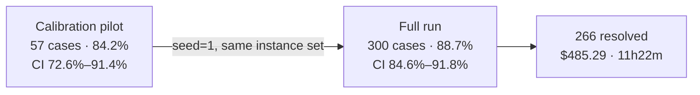
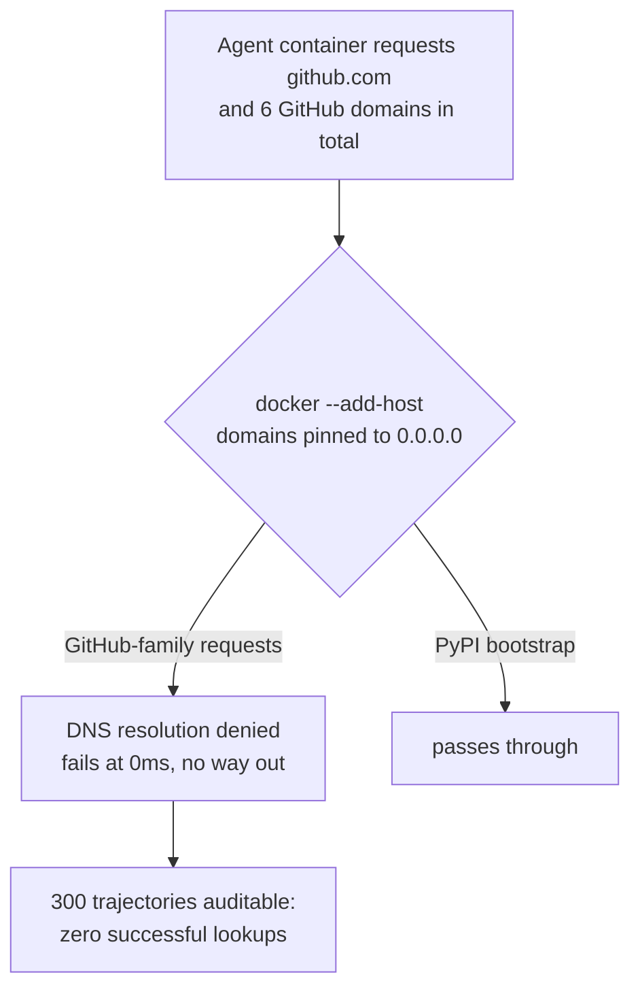
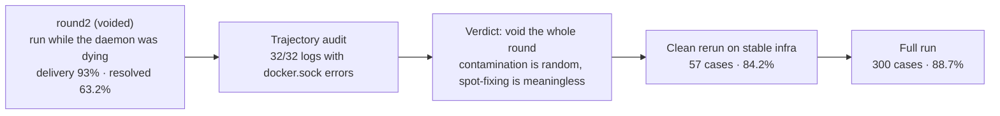

# 88.7% on the Full SWE-bench Lite 300: A harness9 Technical Report

## About harness9

harness9 is a Local-First, lightweight, feature-complete, production-ready Agent framework for Go.

- **Website**: [https://zhangshenao.github.io/harness9/](https://zhangshenao.github.io/harness9/)
- **GitHub**: [https://github.com/ZhangShenao/harness9](https://github.com/ZhangShenao/harness9)

⭐ Stars are the most direct support for open-source work. Issues and PRs are welcome.

---

## TL;DR

- harness9 + the open-weight model moonshotai/kimi-k3 completed all 300 SWE-bench Lite instances: **266 resolved, 88.7%**, Wilson 95% CI [84.6%, 91.8%]. Every number here can be reconciled against public artifacts.
- Strict pass@1 throughout: model-behavior results are never rerun. The single retry was an infrastructure failure (the provider stream for sympy-13146 broke at turn 58); the retry still failed and is kept as a failure.
- "No web answer lookup" is not an honor-system promise: docker `--add-host` pins 6 GitHub domains to 0.0.0.0, so DNS resolution fails inside the container, while the PyPI bootstrap channel stays open.
- All 34 unresolved cases are attributed: 32 model-level failures + 1 deterministic error in the official evaluator itself + 1 empty patch from a 30-minute timeout.
- A daemon-contaminated calibration round (63.2%) was voided in full: a 93% patch delivery rate is not quality. The lesson is codified as a mandatory pre-scoring audit, audit_run_health.py.
- Inference cost $485.29, wall clock 11h22m for the main run; roughly $710 for the whole campaign. The system is open source under MIT and reproducible with one command.

## What you will take away

- The complete methodology of this run: model, cost, duration, sampling discipline, and confidence interval.
- How container-level anti-contamination makes cheating impossible rather than merely promised.
- The composition of 88.7%: per-repo results across 12 repos and the honest attribution of all 34 failures.
- Why a 63.2% round was voided outright, and how the "delivery rate ≠ quality" audit gate works.
- The exact commands and artifact entry points to reproduce the run.

## Results first

The headline: on the full SWE-bench Lite 300, **266/300 = 88.7% resolved**, Wilson 95% CI [84.6%, 91.8%].

A confidence interval is an error bar for a score: rerun a same-sized sample and the true skill most likely lands in that range. This was not a one-shot gamble — a 57-instance calibration pilot beforehand scored 84.2% (CI 72.6%–91.4%), and the full run landed squarely inside that interval. The subset-to-full extrapolation held.



The bill and the clock, in full. The main run cost **$485.29** of inference (136.5M input / 5.05M output tokens) and 11 hours 22 minutes of wall clock (2026-09-13 05:31–16:53) at concurrency 3. Adding roughly $225 for calibration (including the voided round), the whole campaign came to about **$710**, inside an $800 budget.

The model is moonshotai/kimi-k3 — open weights, served via OpenRouter, 1M context, $3/$15 per MTok. harness9 never touches model weights; it provides the runtime. That is the boundary of a harness submission: the score belongs to the framework-plus-model pair, and we are accountable for the framework half — which we ship fully open source.

## What is harness9?

In one sentence: an open-source (MIT) Agent Harness written in Go. The model thinks; harness9 turns thinking into verifiable action.

It ships a standard ReAct loop (think → act → observe → think again), concurrent tool execution within a turn, dual context compaction, native Planning with a PlanStore, Sub-Agent delegation, Docker container-level Sandbox, OpenTelemetry observability, and token-level usage accounting — the cost figures above were reconciled straight out of that accounting.

For the benchmark, each instance follows one path: blobless clone on the host, checkout to the pre-issue base commit, spin up a Docker sandbox, let the Agent fix the code with five tools (bash / read_file / write_file / edit_file / plan_write), collect `git diff` as the model_patch, and let the official harness (swebench 4.1.0, official amd64 evaluation images) inject hidden tests and score.

The Agent never sees the hidden tests. Its inputs are the issue text and the repository — the same starting point any engineer gets when picking up an unfamiliar issue.

## How does one instance run?

The full per-instance configuration: maxTurns=80, 300s timeout per bash command, a 30-minute budget per instance, and a context compaction budget at 55% of the model window. 300 instances at concurrency 3 — that is the 11h22m.

Some settings are not tuning; they grew out of failure trajectories. The closing gate, for instance, injects one prompt when remaining turns drop below a threshold, demanding verification before wrapping up — because pylint-7114 once edited at turn 80 and got truncated with an unverified patch.

```go
// cmd/swebench/runner.go — engine assembly (excerpt)
engine.WithGenerateRetry(4, 2*time.Second),        // transient LLM errors recover
engine.WithStallNudge(stallNudgeWindow, stallNudgeText),          // break read-only stalls
engine.WithPlanningGate(planningGateThreshold, planningGateText), // plan before drifting
engine.WithClosingGate(closingGateThreshold, closingGateText),    // verify before closing
```

These guardrails act on temporary copies sent to the LLM; nothing is persisted and no result is ever altered by them. They shape the Agent's work quality, not the scoring — the official harness remains the sole judge.

One easily missed detail: `git add -A -N` (intent-to-add) runs before patch collection. New files are absent from a plain `git diff`; without this step, a real fix could be silently dropped before scoring.

## How is cheating prevented?

Every SWE-bench task comes from a real GitHub issue, and the upstream repository holds the answer. If the Agent can fetch the issue discussion or the commit page, the score is worthless.

So the anti-contamination design does not rely on promises — it nails the windows shut. The blocklist:

```go
// cmd/swebench/runner.go — trajectories in the v4 eval showed GitHub access on
// 17% of instances, directly polluting the resolve rate. With DNS-level blocking,
// dependency bootstrap still goes through pypi, unaffected.
var swebenchBlockedHosts = []string{
    "github.com",
    "raw.githubusercontent.com",
    "api.github.com",
    "codeload.github.com",
    "objects.githubusercontent.com",
    "gist.github.com",
}
```

Blocking happens at the container layer, one docker flag per domain:

```go
// internal/sandbox/container.go — inside the container, access fails immediately
for _, host := range c.cfg.NetworkBlockedHosts {
    args = append(args, "--add-host", fmt.Sprintf("%s:0.0.0.0", host))
}
```

`--add-host` rewrites the container's DNS resolution: the domains resolve to 0.0.0.0 and connections are refused at the first step. There is no path around it. The PyPI channel is untouched, so dependency bootstrap keeps working. The trajectories are reviewable: across all 300, there is not a single successful fetch of an upstream issue or patch page.



The red lines, stated one by one — this doubles as the official submission checklist:

1. **Strict pass@1**: one rollout per instance, one model_patch each, no best@k, no multi-rollout cherry-picking. The only retry was an infrastructure failure — the provider stream for sympy-13146 broke at turn 58; we reran that instance once as an infra recovery (32m33s, a 407-byte patch), it still failed scoring, and it is kept as a failure. Model-behavior results are never rerun.
2. **No test knowledge**: the FAIL_TO_PASS / PASS_TO_PASS / test_patch fields are loaded by the runner but never enter the Agent's context; hidden tests are injected only at scoring time by the official harness.
3. **No hints**: hints_text is excluded during prompt assembly; the Agent never sees issue comments.
4. **No web answer lookup, with container-level enforcement**: as above; the mechanism lives in `internal/sandbox/container.go` and is verifiable in the trajectories.

One more piece of evidence: at evaluation start we fetch the model metadata from OpenRouter's public endpoint and persist it as `model_snapshot.json` — which model version served this run is on record.

## What makes up the score?

Per-repo results (resolved/total):

| Repo | Result | Rate |
|------|--------|------|
| pylint-dev | 6/6 | 100% |
| pallets (flask) | 3/3 | 100% |
| pytest-dev | 16/17 | 94% |
| django | 106/114 | 93% |
| matplotlib | 21/23 | 91% |
| scikit-learn | 21/23 | 91% |
| sympy | 65/77 | 84% |
| psf (requests) | 5/6 | 83% |
| astropy | 5/6 | 83% |
| pydata (xarray etc.) | 4/5 | 80% |
| mwaskom (seaborn) | 3/4 | 75% |
| sphinx-doc | 11/16 | 69% |

django alone is nearly 40% of the whole benchmark, so its 93% sets the tone. The weakest repo is sphinx (69%), where failures concentrate in the environment-drift class — documentation build chains are sensitive to dependency versions, and sandbox drift from the historical point in time compounds into test results.

300 − 266 = 34 unresolved. The honest breakdown:

- **32 model-level failures**: the same distribution seen during calibration — sphinx environment drift, stubborn astropy/matplotlib instances.
- **1 error in the official evaluator itself**: scikit-learn-13496, where the official harness deterministically raises `EvaluationError`. Across two calibration scoring rounds plus the main run, three independent scorings produced the identical signature — an instance-level evaluation environment problem unrelated to our patch. It counts as unresolved under the official rubric, and we claim no exemption.
- **1 empty patch**: matplotlib-26011, the 30-minute per-instance budget ran out. Under pass@1 discipline it stays unresolved.

Nobody enjoys explaining failures, but the leaderboard's credibility lives exactly in these 34 cases: they are not hidden, they are attributed.

## Why was 63.2% voided?

The most expensive lesson of this campaign. One calibration round (round2, 2026-09-11) ran straight through a period when the Docker Desktop daemon kept dying periodically. Nobody noticed at the time: 57 instances ran to completion, patches were delivered, scoring proceeded — 63.2%, which did not look like a disaster.

The post-mortem audit found the truth: **all 32/32 trajectory logs contained heavy `failed to connect to the docker API` errors** (7 to 62 occurrences per instance). The Agent's bash tool had been unusable the whole time; the model was writing patches blind. The textbook case is django-14855: every command failed from turn 1 onward, and the model still delivered a patch from imagination.

Patch delivery rate: 93%. Resolve rate: 63.2%. The gap between those two numbers is the shape of the contamination.

Our call was to **void the entire round rather than patch it up with reruns**. The reasoning is direct: daemon deaths were randomly distributed across instances, so there is no way to cleanly separate contaminated patches from survivors. Keeping any portion would fold unknown impurities into the score. On a clean rerun in a stable environment, the same 57 instances scored 84.2%.



The lesson became a tool, not a paragraph in a retrospective. We wrote `audit_run_health.py`: it scans trajectory logs for docker.sock error signatures and verifies trajectory coverage completeness. For the main run, all 300 instances passed through this gate before scoring — no pass, no scoring. The main-run audit: zero daemon contamination, trajectory coverage 300/300.

The general conclusion is one sentence: **patch delivery rate ≠ quality**. Any pipeline that scores on delivery alone should first answer: was the execution environment healthy at the time?

## How does this reach the official board?

The submission follows the public SWE-bench/experiments process:

1. **Eligibility**: confirmed in advance via [SWE-bench/experiments#482](https://github.com/SWE-bench/experiments/issues/482).
2. **Submission PR**: the experiment is submitted as a PR to SWE-bench/experiments; this post is the technical report cited by that submission: [SWE-bench/experiments#483](https://github.com/SWE-bench/experiments/pull/483)
3. **Public artifacts**: all predictions (all_preds.jsonl, 300 entries), per-instance scoring logs, and human-readable trajectories generated during inference (trajs, 300/300) live in a public repository, together with the model_snapshot.json evidence and an EXPORT_MANIFEST that records missing items as-is: [ZhangShenao/swebench-lite-20260913](https://github.com/ZhangShenao/swebench-lite-20260913)

The trajectories were generated during inference, not reconstructed afterwards — the official checklist requires this, and it is also what makes the audit possible in the first place.

## How to reproduce?

The system is open source (MIT) and the reproduction path is fully public:

```bash
git clone https://github.com/ZhangShenao/harness9
cd harness9
cp .env.example .env   # fill in your API key; set LLM_MODEL=moonshotai/kimi-k3
./benchmarks/swebench/run-official-lite.sh --output <run directory>
```

Three things to know:

- **Sampling seed is fixed at 1**: the same seed reproduces the same instance set — no "roughly the same".
- **The one-shot script bakes in the quality gate**: audit_run_health.py runs before scoring and checks daemon contamination and trajectory coverage.
- **model_snapshot.json**: the model metadata snapshot captured at evaluation start locks in which model version served the run.

The run directory contains predictions, per-instance logs, and trajs. Reconciling any number in this post against them is the intended use.

## Closing

A leaderboard row can always be made prettier — if you are willing to lay out the ugly 34 alongside the voided 63.2%.

Next time you see an agent benchmark score, ask first: are the trajectories public? Was the execution environment healthy? Were model-behavior results ever rerun?

