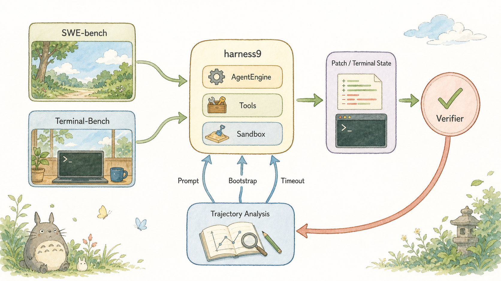
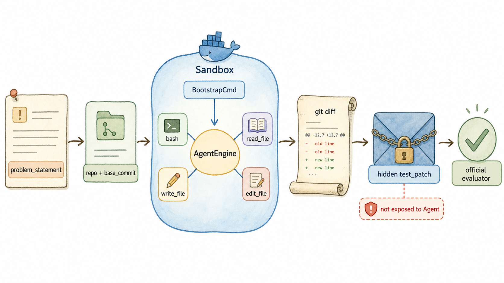
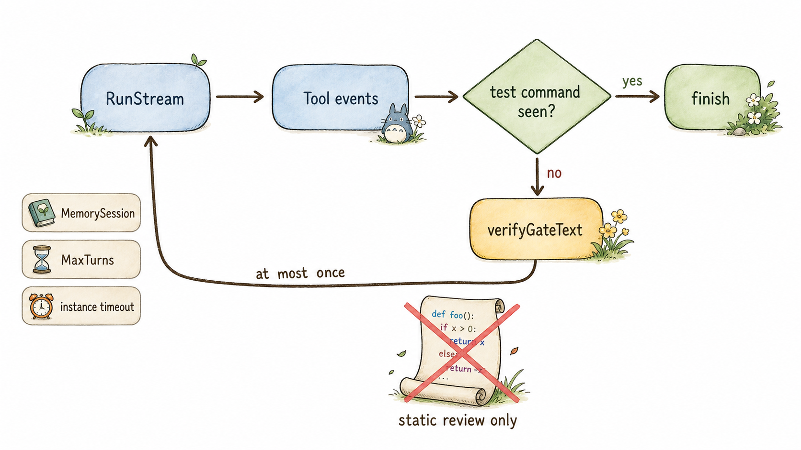
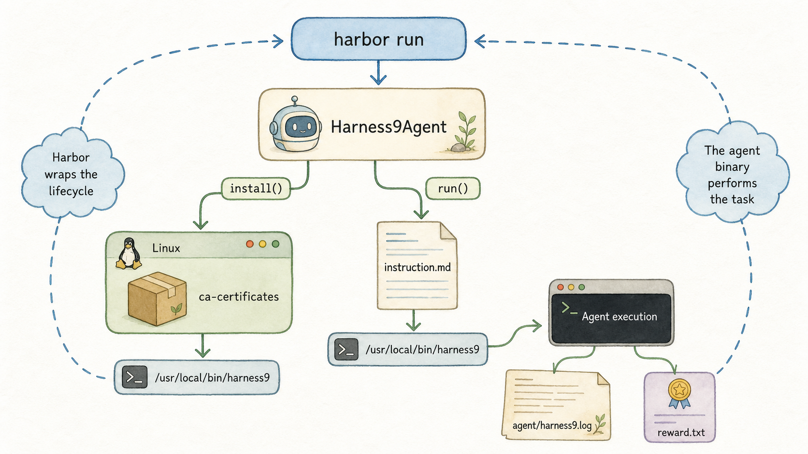
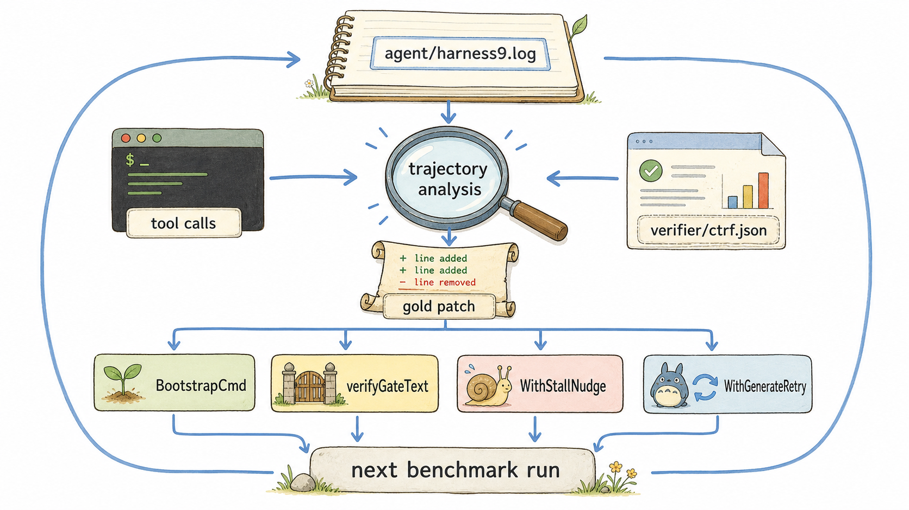
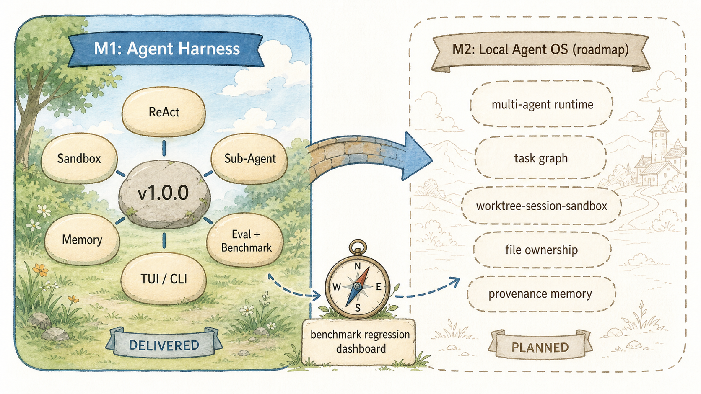

# Benchmark 不只测分数 — harness9 如何用轨迹驱动迭代

## 关于 harness9

harness9 是一款 Local-First、轻量级、功能完备、生产可用的通用 Go Agent 框架。

- **官网**：[https://zhangshenao.github.io/harness9/zh/](https://zhangshenao.github.io/harness9/zh/)
- **GitHub**：[https://github.com/ZhangShenao/harness9](https://github.com/ZhangShenao/harness9)

⭐ Star 是对开源工作最直接的支持，欢迎提 Issue 和 PR。

---

## TL;DR

- SWE-bench 测的是“根据 Issue 产出补丁能否通过隐藏测试”，不是 Agent 是否写出了看似合理的解释。
- Terminal-Bench 通过 Harbor 把终端任务、容器环境、Agent 生命周期和 verifier 结果组合成一个可复现 trial。
- harness9 的 runner 显式隔离隐藏 `test_patch`；它只用于官方判分与运行后分析，不会进入 Agent 上下文。
- 轨迹分析把 `agent/harness9.log`、补丁和 verifier 输出对齐，才能区分内核缺陷、环境问题与模型判断问题。
- SWE-bench 的环境自举、验证关卡、停滞提示和生成重试，都来自具体失败轨迹，而不是经验性堆功能。
- M1 已交付 production-ready Agent Harness；M2“本地 Agent OS”是路线图，不是当前 benchmark 结果或已交付能力。

## 本文你将学到

- 你将看清 SWE-bench 与 Terminal-Bench 分别验证什么，以及二者为什么需要不同的接入边界。
- 你将理解 `test_patch`、`FAIL_TO_PASS` 等评测字段为何只能用于分析，不能泄露给 Agent。
- 你将看清 `runWithVerificationGate` 如何把“改完即收尾”变成一次受限的真实验证续跑。
- 你将掌握如何用轨迹、补丁和 verifier 三类证据给问题归因，而不是把所有失败归咎于模型。
- 你将区分 M1 已交付的 Agent Harness 基线和 M2 本地 Agent OS 的路线图边界。

## 为什么不只看分？

单一 resolved rate 只能说明某次采样的结果。它不能说明 Agent 是否真的执行了测试，也不能说明失败来自 Agent 内核、任务镜像，还是模型本身的推理偏差。

harness9 把 benchmark 看成工程反馈回路。任务进入 `AgentEngine`、工具和 Sandbox；运行留下补丁或终端状态；verifier 给出外部判决；轨迹分析再把结论映射回 Prompt、依赖自举、超时与重试策略。



> 🎨 **图片最终 Prompt**（已用于内置 image_gen）
>
> *SWE-bench 与 Terminal-Bench 共同驱动 harness9 迭代的闭环*
>
> ```
> Use case: infographic-diagram
> Asset type: technical blog body illustration
> Primary request: A clean systems overview titled by node labels only: left column has two benchmark task cards labeled "SWE-bench" and "Terminal-Bench"; both flow through a central rounded node labeled "harness9" with small inner labels "AgentEngine", "Tools", "Sandbox"; then to a right column labeled "Patch / Terminal State" and a final circular node labeled "Verifier". From Verifier a large return arrow goes down to a bottom node labeled "Trajectory Analysis", which sends small arrows back to harness9 components labeled "Prompt", "Bootstrap", "Timeout". Show that benchmarks drive product iteration, not just scoring. Labels must be spelled exactly as provided and be sparse.
> Style/medium: Studio Ghibli minimalist illustration style, soft watercolor washes, gentle pastel palette, clean white background, hand-drawn rounded shapes for nodes, warm earthy tones with sky blue accents, flowing organic arrows to show data flow, simple sans-serif labels, whimsical yet precise technical diagram, quiet and serene atmosphere, Hayao Miyazaki sketch aesthetic meets infographic clarity, no gradients, flat color fills, subtle paper texture, 16:9 aspect ratio.
> Constraints: no extra text, no watermark, no logo, landscape 16:9
> ```

这里的关键不是把 benchmark 当作 CI 的一个数字门槛，而是把它当成观测接口。没有足够的中间证据，分数变化无法指导下一次改动。

## 两类任务差在哪？

SWE-bench 的输入是仓库、基线提交和 Issue 描述。Agent 在隔离工作区内修改代码，runner 收集 `git diff`，官方评估器再把隐藏测试补丁应用到副本上判分。`cmd/swebench/dataset.go` 解析 `test_patch`、`FAIL_TO_PASS` 和 `PASS_TO_PASS`，但注释明确规定：它们绝不在 Agent 运行时暴露或应用。

看这一段数据边界。`ProblemStatement` 是输入；`TestPatch` 是评测器的私有输入。两者不能混在同一个 Prompt 里。

```go
// TestPatch 是评测阶段注入的隐藏测试补丁。同样**绝不**在 Agent 运行时应用。
TestPatch string `json:"test_patch"`
```

Terminal-Bench 则要求 Agent 在真实终端任务中交付最终状态。Harbor 负责启动任务环境、调用适配器和运行 verifier；reward 记录在 trial 的 `verifier/reward.txt`。它不以 Git patch 作为唯一产物，环境与命令执行本身就是任务的一部分。



> 🎨 **图片最终 Prompt**（已用于内置 image_gen）
>
> *SWE-bench 的输入、隔离执行、隐藏测试与官方判分边界*
>
> ```
> Use case: infographic-diagram
> Asset type: technical blog body illustration
> Primary request: A left-to-right SWE-bench execution pipeline diagram. At far left an issue card labeled "problem_statement" flows to a repository card labeled "repo + base_commit". It flows to a rounded Docker island labeled "Sandbox" with a small command label "BootstrapCmd". Inside the island a central node labeled "AgentEngine" uses four small tool nodes labeled "bash", "read_file", "write_file", "edit_file". The output flows to a git patch scroll labeled "git diff", then to a locked envelope labeled "hidden test_patch", then a checkmark node labeled "official evaluator". Add a small red safety badge next to hidden test_patch reading "not exposed to Agent". Labels must be exact, sparse, and readable. Flow arrows must show data direction.
> Style/medium: Studio Ghibli minimalist illustration style, soft watercolor washes, gentle pastel palette, clean white background, hand-drawn rounded shapes for nodes, warm earthy tones with sky blue accents, flowing organic arrows to show data flow, simple sans-serif labels, whimsical yet precise technical diagram, quiet and serene atmosphere, Hayao Miyazaki sketch aesthetic meets infographic clarity, no gradients, flat color fills, subtle paper texture, 16:9 aspect ratio.
> Constraints: no extra text, no watermark, no logo, landscape 16:9
> ```

这也是两个 benchmark 可以共用 Agent 内核、却不该共用一套“完成”定义的原因：SWE-bench 产出可评分补丁，Terminal-Bench 产出可验证的环境状态。

## SWE 怎么接入？

`runInstance` 的路径很直白：宿主机用 `git clone --filter=blob:none` 获取基线，再创建绑定 workDir 的 Docker Sandbox，注册文件与 shell 工具，最后以 `RunStream` 执行 Agent。它以独立 context 收集 diff，因此主执行被取消时仍能保留已完成的修改。

```go
_ = exec.CommandContext(diffCtx, "git", "-C", tmpDir, "add", "-A", "-N").Run()
patchOut, _ := exec.CommandContext(diffCtx, "git", "-C", tmpDir, "diff").CombinedOutput()
patch := strings.TrimSpace(string(patchOut))
```

`git add -A -N` 不是装饰。新建文件默认不在普通 `git diff` 中；intent-to-add 让它以新增 hunk 进入 `model_patch`，否则一个真实修复可能在提交评分前被静默丢掉。

runner 还为 benchmark 设定专用边界：未显式配置时使用 `python:3.11`，通过 `BootstrapCmd` 执行 editable 安装和 pytest 自举；工具侧将 bash 超时放宽到 300 秒；上下文侧启用 `TokenBudgetCompactor`，预算为模型窗口的 55%；引擎侧启用 `WithGenerateRetry(4, 2*time.Second)` 与默认 80 Turn 上限。这些都服务于同一目标：让失败能被观察、能恢复、也能在失控前停止。

## 验证怎么强制？

第一轮 SWE-bench 轨迹曾暴露一个比“模型不会修代码”更基础的问题：24 条轨迹没有一条真正执行测试，全部被缺 pip 或依赖的环境拦住。静态分析能偶然命中简单题，却没有反馈把复杂修复收敛到正确位置。

`runWithVerificationGate` 因而不改通用 Agent loop，而在 benchmark runner 中观察 `bash` 事件。Agent 自然结束、且没有检测到测试命令时，runner 才注入一次 `verifyGateText` 并沿用同一 `MemorySession` 续跑。

```go
ranTest, runErr := streamOnce(ctx, eng, w, userPrompt)
if !ranTest && ctx.Err() == nil {
    ranTest2, err2 := streamOnce(ctx, eng, w, verifyGateText)
    runErr = errors.Join(runErr, err2)
    if !ranTest2 { /* 记录环境或行为问题 */ }
}
```

这不是无限循环。它只触发一次，仍受实例超时和 `MaxTurns` 约束。`looksLikeTestRun` 还只对 bash 的 `command` 字段做启发式判断，避免把 `grep pytest` 误当作验证。



> 🎨 **图片最终 Prompt**（已用于内置 image_gen）
>
> *验证关卡如何在未执行测试时只续跑一次*
>
> ```
> Use case: infographic-diagram
> Asset type: technical blog body illustration
> Primary request: A verification-gate state flow for SWE-bench. Rounded nodes in sequence: "RunStream" → "Tool events" → a diamond labeled "test command seen?". The yes path goes to "finish". The no path goes to a single warm yellow prompt bubble labeled "verifyGateText", then returns to "RunStream" using the same path, and a small label on the loop says "at most once". Around the loop show three guardrails as small badges: "MemorySession", "MaxTurns", "instance timeout". Under the diamond, show a crossed-out static code scroll labeled "static review only". Labels must be exactly as provided and readable.
> Style/medium: Studio Ghibli minimalist illustration style, soft watercolor washes, gentle pastel palette, clean white background, hand-drawn rounded shapes for nodes, warm earthy tones with sky blue accents, flowing organic arrows to show data flow, simple sans-serif labels, whimsical yet precise technical diagram, quiet and serene atmosphere, Hayao Miyazaki sketch aesthetic meets infographic clarity, no gradients, flat color fills, subtle paper texture, 16:9 aspect ratio.
> Constraints: no extra text, no watermark, no logo, landscape 16:9
> ```

## Terminal 怎么接入？

Terminal-Bench 2.0 的接入被收敛在 `benchmarks/terminal_bench/harness9_agent.py`。`Harness9Agent` 继承 Harbor 的 `BaseInstalledAgent`：`install()` 把静态编译的二进制上传到 `/usr/local/bin/harness9`；`run()` 上传多行 instruction 文件，再非交互执行二进制。

```python
await self.exec_as_agent(
    environment,
    command=(
        f"{_BINARY_REMOTE_PATH} --prompt-file {_INSTRUCTION_REMOTE_PATH} "
        f"> {_RUN_LOG_REMOTE_PATH} 2>&1"
    ),
    env=run_env,
    timeout_sec=_ABSOLUTE_TIMEOUT_SEC,
)
```

这里的重点是超时权责。Harbor 的外层会按各任务 `task.toml` 的 `agent.timeout_sec` 裁决；适配器只保留 4 小时绝对兜底，避免一个统一的内层数字抢先终止声明了更长预算的任务。

`install()` 还主动安装 `ca-certificates`。这来自轨迹复核：部分官方镜像没有系统 CA 信任链，静态 Go 二进制访问 HTTPS 会确定性失败；把它当作网络抖动来重试没有意义。



> 🎨 **图片最终 Prompt**（已用于内置 image_gen）
>
> *Harbor 如何通过 Harness9Agent 调度二进制、日志与 reward*
>
> ```
> Use case: infographic-diagram
> Asset type: technical blog body illustration
> Primary request: A Terminal-Bench and Harbor adapter execution diagram. A top node labeled "harbor run" flows to a rounded class card labeled "Harness9Agent". From it, an "install()" branch goes to a Linux task container labeled "ca-certificates" then to a small binary labeled "/usr/local/bin/harness9". A "run()" branch flows to a document labeled "instruction.md", then to the harness9 binary, then to a terminal labeled "Agent execution". The terminal writes a log file labeled "agent/harness9.log" and a separate verifier card labeled "reward.txt". Use arrows to show that Harbor wraps the lifecycle, but the agent binary performs the task. Labels must be exact and readable.
> Style/medium: Studio Ghibli minimalist illustration style, soft watercolor washes, gentle pastel palette, clean white background, hand-drawn rounded shapes for nodes, warm earthy tones with sky blue accents, flowing organic arrows to show data flow, simple sans-serif labels, whimsical yet precise technical diagram, quiet and serene atmosphere, Hayao Miyazaki sketch aesthetic meets infographic clarity, no gradients, flat color fills, subtle paper texture, 16:9 aspect ratio.
> Constraints: no extra text, no watermark, no logo, landscape 16:9
> ```

## 轨迹怎么反推？

轨迹不是调试日志的副产品。`agent/harness9.log` 给出每轮 LLM 输出、工具调用和耗时；SWE-bench 的 `git diff` 或 Terminal-Bench 的最终环境给出实际行为；`verifier/ctrf.json`、`test-stdout.txt` 与 `reward.txt` 给出外部判决。三者必须一起读。



> 🎨 **图片最终 Prompt**（已用于内置 image_gen）
>
> *从执行轨迹、补丁和 verifier 证据推导下一轮改动*
>
> ```
> Use case: infographic-diagram
> Asset type: technical blog body illustration
> Primary request: A trajectory-driven engineering diagnosis diagram. At the top, a notebook labeled "agent/harness9.log" flows downward into a magnifying glass node labeled "trajectory analysis". Three evidence streams converge there: a terminal card labeled "tool calls", a patch scroll labeled "gold patch", and a test report card labeled "verifier/ctrf.json". The analysis produces four small actionable cards in a row: "BootstrapCmd", "verifyGateText", "WithStallNudge", "WithGenerateRetry". Each card has an arrow to a bottom node labeled "next benchmark run". Make the converging evidence and the change-feedback loop visually unmistakable. Labels must be exact and readable.
> Style/medium: Studio Ghibli minimalist illustration style, soft watercolor washes, gentle pastel palette, clean white background, hand-drawn rounded shapes for nodes, warm earthy tones with sky blue accents, flowing organic arrows to show data flow, simple sans-serif labels, whimsical yet precise technical diagram, quiet and serene atmosphere, Hayao Miyazaki sketch aesthetic meets infographic clarity, no gradients, flat color fills, subtle paper texture, 16:9 aspect ratio.
> Constraints: no extra text, no watermark, no logo, landscape 16:9
> ```

这套证据链也约束结论的力度。一个重跑由 0 翻到 1，可能是模型采样差异；只有同一失败模式被定位、修复并通过针对性复跑，才可以归因于 harness 改动。相反，镜像缺少 CA、任务预算不足和 Agent 未验证产物，分别属于环境、评测适配与模型行为，不能被包装成“引擎进步”。

SWE-bench Lite 的同 seed=1、同 24 实例对比记录为 16/24 到 19/24，真实测试运行实例从 1/24 到 18/24，且无回归。这个变化的价值不只是 +12.5pp，而是从“静态猜测”恢复为“测试反馈驱动”的闭环。

## M1 到 M2

M1 是 v1.0.0 的 production-ready Agent Harness 基线：ReAct engine、Provider、Tools、Sandbox、Human-in-the-Loop、MCP、Web、Planning、Skills、Sub-Agent、AutoDev、短期与长期记忆、Eval、SWE-bench、Terminal-Bench、OpenTelemetry、TUI、CLI 与双语站点都已纳入交付范围。

M2 是“本地 Agent OS”的**路线图**，不是已交付能力，也不是 benchmark 得分的外推。它要解决的是多 Agent runtime、角色与权限、任务图与调度、worktree-session-sandbox 生命周期、可恢复状态、冲突感知的文件所有权、分层记忆及 provenance、benchmark/regression dashboard 与操作面板。


> 🎨 **图片最终 Prompt**（已用于内置 image_gen）
>
> *M1 已交付基线与 M2 本地 Agent OS 路线图的边界*
>
> ```
> Use case: infographic-diagram
> Asset type: technical blog body illustration
> Primary request: A roadmap diagram with two clearly separated columns. Left column titled "M1: Agent Harness" contains six rounded capability stones labeled "ReAct", "Sandbox", "Sub-Agent", "Memory", "Eval + Benchmark", "TUI / CLI" around a stable foundation stone labeled "v1.0.0". A bridge arrow goes to the right column titled "M2: Local Agent OS (roadmap)". The right column is intentionally shown as outlined, not completed, and contains five future capability stones labeled "multi-agent runtime", "task graph", "worktree-session-sandbox", "file ownership", "provenance memory". A small compass labeled "benchmark regression dashboard" points from M1 evidence toward M2. Make the visual distinction between delivered M1 and planned M2 unmistakable. Labels must be exact and readable.
> Style/medium: Studio Ghibli minimalist illustration style, soft watercolor washes, gentle pastel palette, clean white background, hand-drawn rounded shapes for nodes, warm earthy tones with sky blue accents, flowing organic arrows to show data flow, simple sans-serif labels, whimsical yet precise technical diagram, quiet and serene atmosphere, Hayao Miyazaki sketch aesthetic meets infographic clarity, no gradients, flat color fills, subtle paper texture, 16:9 aspect ratio.
> Constraints: no extra text, no watermark, no logo, landscape 16:9
> ```

M2 的前提不是先堆一个调度器，而是继续保留 M1 已建立的可验证性：每个角色做了什么、改了哪个 worktree、在什么 Sandbox 中运行、用过哪条记忆、由哪个 benchmark 证明没有回归，都必须能追溯。

## 结语

把 benchmark 当作证据链，Agent 才能从“偶尔答对”走向“每次改动都能解释”。

## 封面图



> 🎨 **封面图最终 Prompt**（横版，适配文章头图 / 社交分享卡片）
>
> *M1 已交付基线与 M2 本地 Agent OS 路线图的边界*
>
> ```
> Use case: infographic-diagram
> Asset type: technical blog body illustration
> Primary request: A roadmap diagram with two clearly separated columns. Left column titled "M1: Agent Harness" contains six rounded capability stones labeled "ReAct", "Sandbox", "Sub-Agent", "Memory", "Eval + Benchmark", "TUI / CLI" around a stable foundation stone labeled "v1.0.0". A bridge arrow goes to the right column titled "M2: Local Agent OS (roadmap)". The right column is intentionally shown as outlined, not completed, and contains five future capability stones labeled "multi-agent runtime", "task graph", "worktree-session-sandbox", "file ownership", "provenance memory". A small compass labeled "benchmark regression dashboard" points from M1 evidence toward M2. Make the visual distinction between delivered M1 and planned M2 unmistakable. Labels must be exact and readable.
> Style/medium: Studio Ghibli minimalist illustration style, soft watercolor washes, gentle pastel palette, clean white background, hand-drawn rounded shapes for nodes, warm earthy tones with sky blue accents, flowing organic arrows to show data flow, simple sans-serif labels, whimsical yet precise technical diagram, quiet and serene atmosphere, Hayao Miyazaki sketch aesthetic meets infographic clarity, no gradients, flat color fills, subtle paper texture, 16:9 aspect ratio.
> Constraints: no extra text, no watermark, no logo, landscape 16:9
> ```
