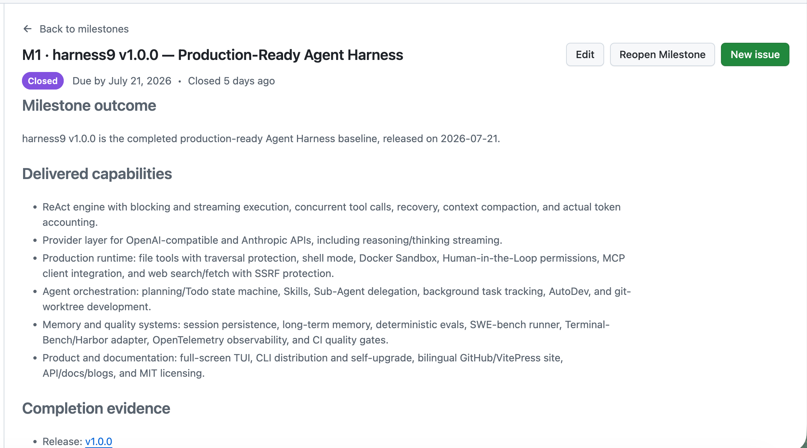
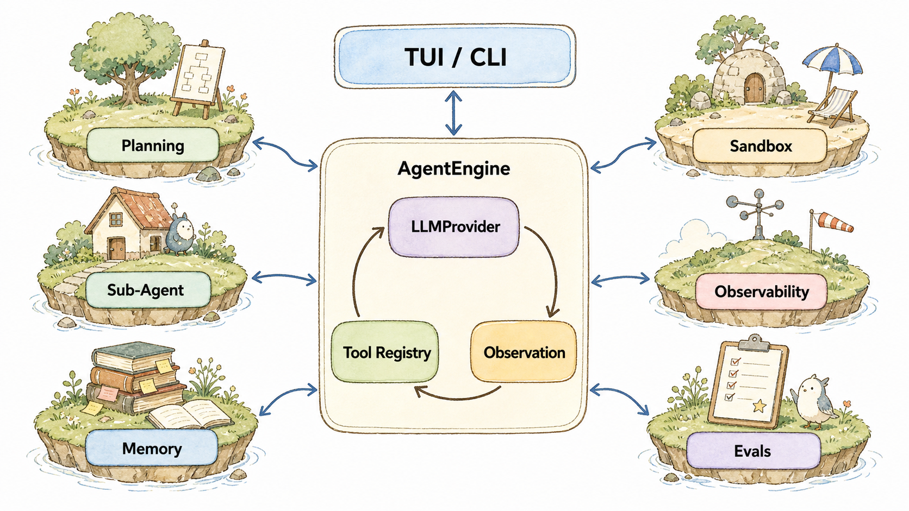
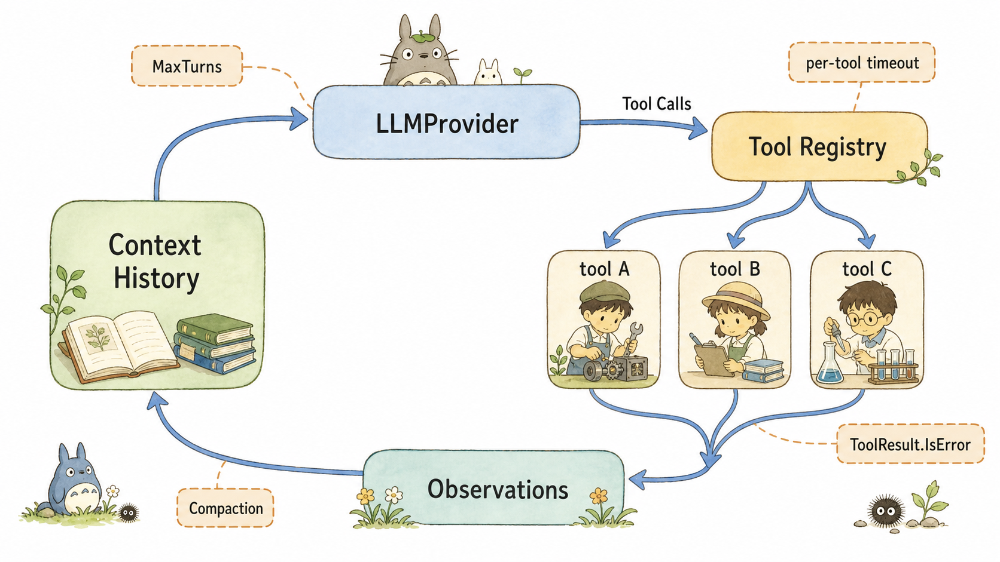
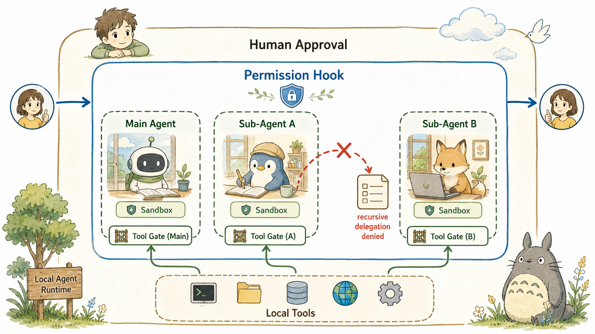
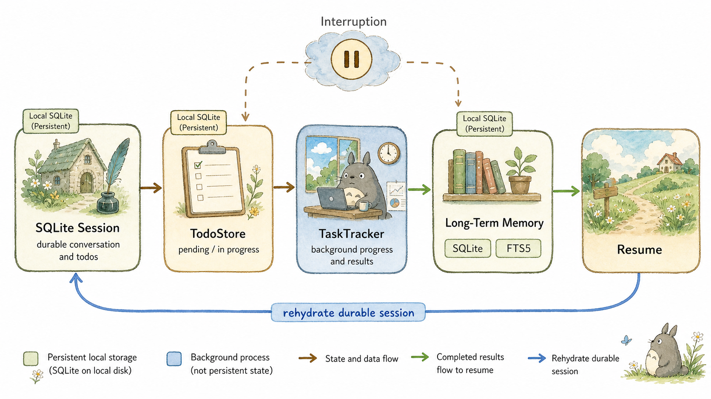
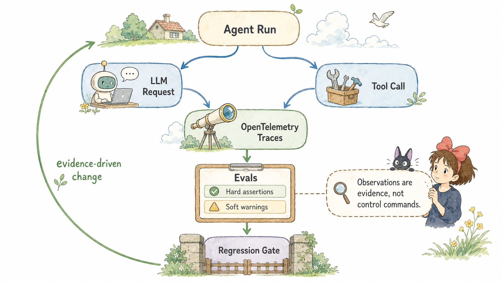
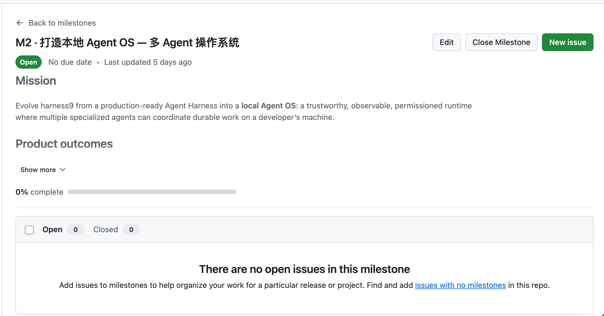

# M1 完成之后：harness9 为什么要走向本地 Agent OS

## 关于 harness9

harness9 是一款 Local-First、轻量级、功能完备、生产可用的通用 Go Agent 框架。

- **官网**：[https://zhangshenao.github.io/harness9/zh/](https://zhangshenao.github.io/harness9/zh/)
- **GitHub**：[https://github.com/ZhangShenao/harness9](https://github.com/ZhangShenao/harness9)

⭐ Star 是对开源工作最直接的支持，欢迎提 Issue 和 PR。

---

## TL;DR

- Milestone-1 终于完成了！harness9 现在不只是“能跑一下”的 Agent，而是有执行、边界、记忆、隔离和检查的一套本地底座。
- 对于增加系统复杂度这件事，我们一直相当克制：同一套核心逻辑服务命令行和流式界面，少一份重复，就少一份以后难查的差异。
- Agent 能做什么、这次能不能做、问题出在哪里，是三件不同的事。M1 把它们分开处理。
- Sub-Agent、Planning、Context Engineering 和 Memory 等基础能力已经 ready；M2 要补上的，是让多个 Agent 能一起干活、暂停后接得上、过程也说得清的那层协调机制。
- M2 已经开始搭建 Mission Foundation。它不会急着做一个“什么都能调度”的大平台，而是先把本地开发任务的计划、审批、执行、交接和验收走稳。
- 这一路花了很久，也投入了很多心血。走到 M1 这个里程碑，不是终点，而是终于有了值得继续往前走的地基！

## 本文你将学到

- 你将看懂一个 Agent 从“想一想”到“真的动手”时，harness9 怎样让它不乱跑。
- 你将理解为什么权限、隔离和工具，不该混成一句提示词里的要求。
- 你将分清 M1 已经交付的能力，和 M2 正在补齐的协作能力。
- 你将看到我们怎样用测试和记录来判断“真的做好了”，而不是只看模型说得像不像。
- 你将知道 M2 想做什么，也知道它刻意不做什么。

## M1 我们做了哪些工作？

GitHub M1 已完成，`harness9 v1.0.0` 也已经在 2026-07-21 发布。看到它关闭的那一刻，心里很安静，也很踏实。



这个项目走了很久。一路上，我们不是只在给 Agent 加功能，而是在反复追问：它真要动手时，能不能看得见、拦得住、出了问题能不能找到原因？很多看上去不起眼的细节，背后都是一次次推翻、补测试、再收紧边界。M1 的完成，意味着这些问题终于有了一套经得住使用的回答。

所以，M1 不等于“接上一个模型”。它交付的是一个 Agent 在自己电脑上可以被认真对待的底座：能运行，也有规则；能做事，也留得下记录。M2 才是在这个底座上，让多个 Agent 学会配合。




这张图不能代替代码，但它能帮人一眼看懂 M1 的分工。`AgentEngine` 在中间，却不是一个人扛下所有事。Planning 负责把事情列清楚；Sub-Agent 帮忙拆活；Memory 不让信息只留在一次聊天里；Sandbox 和权限链负责守边界；Observability 与 Evals 则负责留下“发生过什么、做得对不对”的记录。

最容易走偏的做法，是把所有事情都塞进 Agent 的主循环。这样一开始省事，后面每加一个功能都可能牵一发动全身。harness9 选了更慢、但更稳的路：让这些能力围着核心接入，而不是挤进核心。`EngineObserver` 就是一个小例子——它只在一次对话和每一轮开始、结束时接住信息，不去打扰核心工作。

```go
type EngineObserver interface {
	OnInteractionStart(ctx context.Context, sessionID, prompt string) context.Context
	OnInteractionEnd(ctx context.Context, turns int, err error)
	OnTurnStart(ctx context.Context, turn int) context.Context
	OnTurnEnd(ctx context.Context, turn int, hasToolCalls bool)
}
```

这份约定让默认的 `noopObserver` 几乎不用额外成本，也让 OpenTelemetry 能把一次对话里模型和工具的过程串起来。说白了，M1 的一个坚持是：内核要尽量稳定，想加的新功能要有边界，能看得见、查得清。

## Agent 的本质还是 ReAct Loop

Agent 的工作方式其实不难理解：它先看看已有的信息和能用的工具，再决定回答，或者调用工具继续做事；工具的结果回来后，它再接着想。M1 把这个来回过程收在同一个 `runLoop` 里。

能同时做的事，就不必硬排队。但“同时”不等于放任。每个工具都有时间限制，整个过程也有轮数上限；结果回来时依旧按稳定顺序放回去。我们希望它跑得更快，也希望出现问题时有清晰的排查链路。




看下面这段 `runLoop`。每一轮开始时，它会拿到这次真正允许用的工具。这里不是“拜托模型别乱用”的口头提醒，而是程序只把允许的工具交给模型。在规划阶段，写文件这类工具会被挡在外面。

```go
availableTools := e.registry.GetAvailableTools()
if planMode == planning.PlanModePlan {
	availableTools = filterReadOnlyTools(availableTools)
}

msgTokensBefore := memory.EstimateTokens(contextHistory)
compactedHistory := e.applyCompactionWith(comp, contextHistory)
msgTokensAfter := memory.EstimateTokens(compactedHistory)
em.tokenUpdate(msgTokensAfter+toolTokens, e.contextWindow)
```

命令行里的 `Run`，和界面里一边生成一边显示的 `RunStream`，表面上是两种体验，但底下没有各写一套循环。它们只是把结果用不同方式交给用户。这样一来，轮数、压缩、审批和工具调用都只有一份规则。以后修复一个问题，两边一起生效，不会出现“命令行没事，界面又不一样”的尴尬。

工具失败也不急着把整件事掐断。harness9 会把 `ToolResult{IsError: true}` 交回给模型，让它知道哪里没走通：它可以换个参数、换条路，或者坦白告诉用户限制在哪。所谓“自愈”，关键是别把错误吞掉，错误也是关键的 Context，它能指导 Agent 的下一步工作。

## Prompt 不靠谱，约束 Agent 要靠权限与 Guardrail

本地 Agent 真正让人担心的，不是它会不会写几句话，而是它会不会执行命令、改文件、访问网络。只靠一句“请小心操作”并不可靠。M1 把这件事拆开来做：它有什么能力、这一次是否被允许、就算出错又会被关在哪里，分别处理。

- Tool Registry 决定 Agent 看到且能调用哪些 `BaseTool`。
- Hook + Human-in-the-Loop 决定某次调用是 `allow`、`deny` 还是 `ask`。
- Sandbox 通过 `Environment` 将 bash 和文件操作路由到本地进程或 Docker 容器。




`Environment` 只负责几件很实际的事：跑命令、读文件、写文件、关掉环境。工具不用自己分辨是在电脑上跑，还是在 Docker 容器里跑。打开 Docker 后，`bash` 会进容器执行，文件依旧指向同一个工作目录；不打开时，一切照旧走 `LocalEnvironment`。新能力不能把旧用法弄坏，这也是我们一直守住的底线。

```go
type Environment interface {
	RunBash(ctx context.Context, cmd, workDir string) (string, error)
	ReadFile(ctx context.Context, path string) ([]byte, error)
	WriteFile(ctx context.Context, path string, data []byte) error
	ID() string
	Close(ctx context.Context) error
}
```

Sub-Agent 也不是看见一句“不要继续派人”就会老实。`ResolveTools` 会直接收紧它能用的工具，并且拿掉 `task`。这样 Sub-Agent 就不能再递归委派，也不能靠几句输入把权限要回来。这个道理很朴素：真正值得信任的，不是 Agent 说自己会克制，而是程序在该拒绝、该暂停、该找人确认的时候，真的能把它拦住。

## 状态有了，协调还没有

M1 已经把很多“别只靠脑子记”的事情落到了本地。SQLite Session 会保存会话和待办；`TodoStore` 知道一件事是在等着做、正在做，还是已经完成；长期记忆会把跨会话的信息留下来；后台 Sub-Agent 的进度和结果，则由 `TaskTracker` 先接住，等主 Agent 接着处理。




不过，我们也不想夸大 M1 的工作。`TaskTracker` 现在负责的是当前进程里的后台任务：它会保护好进度，完成后让主 Agent 拿一次结果。它已经把当下的并发和重复消息管住了，但还不是那种电脑重启后，整张任务关系、谁该重试、谁在占用工作区都能自动接上的系统。

```go
func (t *TaskTracker) DrainCompleted() []CompletedTask {
	t.mu.Lock()
	defer t.mu.Unlock()
	var out []CompletedTask
	for _, task := range t.tasks {
		if task.state != TaskRunning && !task.injected {
			task.injected = true
			out = append(out, CompletedTask{TaskID: task.id, AgentName: task.agentName,
				FinalText: task.finalText, IsError: task.isError})
		}
	}
	return out
}
```

这不是 M1 少做了什么，而是我们给 M2 留下的起点。M1 先把会话、计划、记忆、后台工作和隔离 Agent 各自站稳。M2 再把它们接成一条完整的路：谁负责哪件事，谁能改哪个工作区，前面的事没做完后面的事怎么等，电脑中断后又从哪里继续，以及恢复时会不会绕开原来的权限。

## Talk is cheap, show me the trajectory

Agent 很容易给人一种“看起来挺会做”的感觉。但真正做过项目的人都知道，能说出来和能稳定做到，中间差得很远。M1 因此把过程记录和自动检查放在开发当中，而不是等出问题了才去翻日志。

`OTELEngineObserver` 会把一次对话和每一轮的过程串起来；Provider 会留下模型请求和 token；Tool Hook 会记录工具真的做了什么。另一边，`EvalHarness` 用固定脚本去检查：该不该调用工具、最后说了什么、有没有报错、绕了多少轮。该失败的就明确失败，只是提醒的就给提醒。我们不把所有信号揉成一个看上去漂亮、却说不清原因的分数。




到了 M2，这件事只会更重要。多个 Agent 一起干活，可能卡在前后依赖，也可能碰到不同工作区和中断恢复。只看最后一句“我做完了”，根本不知道问题出在安排、权限，还是某个 Agent 越了界。所以 M2 的每一项工作，都要继续把边界、权限、过程记录和验收方式写清楚。

## 目标展望：M2 要做什么？

harness9 M2 的目标叫“本地 Agent OS”。听起来很大，但我们想做的事情其实很具体：可以在本地批量调度一系列 Agent，让它们协作完成复杂的长程任务，并且整个过程可审批、可监控、可管理、可暂停，也能在中断后有据可查地继续。



这件事已经开始。现在正在推进的是 Mission Foundation：先把任务、计划、审批、工作区和验收结果这些最容易混乱的东西，放到同一套本地记录里。一部分基础状态和本地记录已经落到代码；接下来还要把变更审批、调度和端到端协作继续做实。我们宁愿把这层地基打实，也不急着把“多 Agent”做成热闹的表演。

| M2 结果面 | M1 已有基础 | M2 正在补齐 |
|---|---|---|
| 多 Agent 一起干活 | `SubAgentDefinition`、`Runner`、前后台执行、独立 Session | 明确能做什么、何时取消或重试、中断后怎么接上 |
| 任务怎么协作 | `TaskTracker`、Todo 状态、工具 Hook | 谁先做、谁后做、消息怎么交接、多人改文件时怎么避免撞车 |
| 本地工作区 | workDir、worktree、Sandbox、Session | 工作区怎么分配和回收，产物和过程怎么留下来 |
| 记忆与知识 | LTM、FTS5、`MEMORY.md` 物化视图 | 项目、用户和 Agent 的信息怎么区分、更新和由用户掌控 |
| 用结果说话 | Evals、CI gate、OTEL trace | 更完整的回归检查，以及出了问题能回溯到哪一步 |
| 看得见、管得住 | TUI、CLI、审批、Sandbox/MCP 状态栏 | 在一个地方查看 Agent、任务、成本、过程和长任务状态 |

顺序比速度更重要。先让所有人都能知道“现在到底发生了什么”，再谈开多少个 Agent 一起跑。没有可靠的任务记录、明确的负责范围和取消规则，多开几个后台 Agent，只会把偶发问题放大成更难复现的麻烦。

权限也是一样。子任务可以少拿权限，不能多拿；系统从中断里恢复，也不能偷偷绕过原本需要人确认的操作。这些听上去不炫，但它们决定了这套系统是不是能让人放心交给它。

M2 也提前说清楚了哪些事不做：不去建设云端的大平台，不让外部账号在没人确认的情况下自动行动，不喊口号要取代操作系统，也不做酷炫的 GUI 交互。
把“不做什么”讲明白，才能把有限的心力留给最重要的事：在开发者自己的机器上，做出一套可信、看得见、能回头检查的协作方式。

## 结语

M1 终于达成了。它不是一张漂亮的功能清单，而是很多次认真取舍、很多个边角补齐之后，交到我们手里的一个阶段性答案。

我们知道，M2 会更难。当多个 Agent 同时行动、暂停、失败、再恢复时，开发者还能不能一直看清、控制并信任系统？这就是接下来要继续回答的问题。

但今天也值得停下来，认真记住这个时刻：harness9 已经走过了最开始那段只有想法、没有底气的路。谢谢每一份投入的心血。M1 是一个里程碑，也是继续往前的起点！

(PS. 一个人写代码还是蛮无聊的，如果大家对 harness9 这个项目感兴趣，欢迎一起来共建呀~)

---

## 封面图


> 🎨 **封面图最终 Prompt**（横版，适配文章头图 / 社交分享卡片）
>
> *M1 之后，向新的本地 Agent OS 出发*
>
> ```
> Use case: illustration-story
> Asset type: Chinese technical blog cover image and social sharing card for the article “M1 完成之后：harness9 为什么要走向本地 Agent OS”.
> Primary request: A warm, cinematic narrative illustration that conveys a long-running local developer project reaching a meaningful milestone and setting out toward a hopeful next chapter. At dawn, a small handcrafted workshop glows on a quiet hill. A developer and a gentle small robot companion stand at its open doorway, looking toward a distant landscape where several softly lit paths converge into a new horizon. On the workbench behind them are subtle paper notes, a lantern, and a few tiny wooden mechanisms, suggesting careful craft and many nights of work. The mood is quiet pride, relief, gratitude, and renewed curiosity—not triumphalism.
> Scene/backdrop: misty mountains, early golden sunlight, a calm sky, wild grass and lanterns along the path.
> Style/medium: original hand-painted cinematic animation illustration, soft watercolor and gouache textures, rich layered foreground/midground/background, elegant and emotionally resonant; not a technical diagram.
> Composition/framing: wide 16:9 landscape composition, visual focus centered slightly left, generous negative space on the right for optional page overlay, suitable as a blog cover.
> Lighting/mood: warm dawn light, peaceful, intimate, hopeful.
> Constraints: absolutely no text, no labels, no charts, no architecture diagram, no UI screenshot, no logo, no watermark, no copied composition from any existing body illustration.
> Avoid: dark cyberpunk scene, generic office stock imagery, technical flowcharts, illegible words, gradients that look synthetic.
> ```
