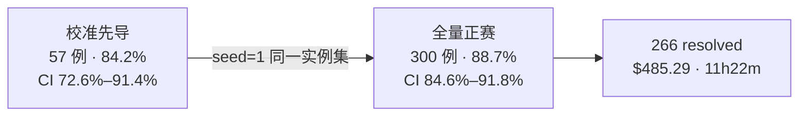
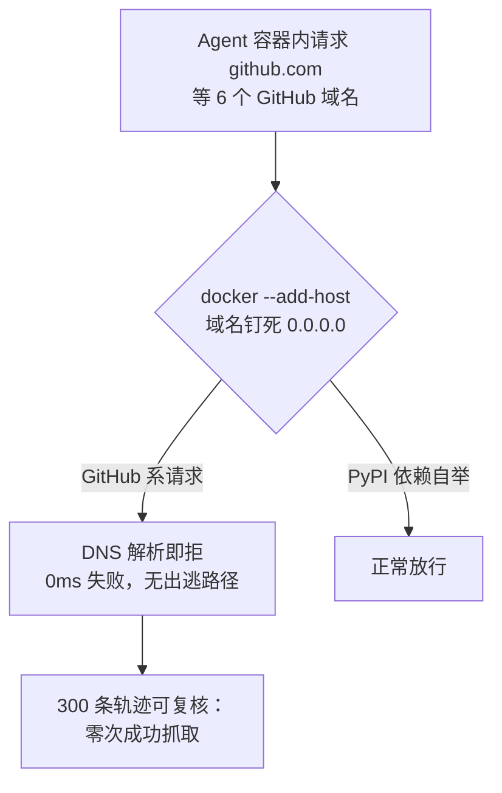
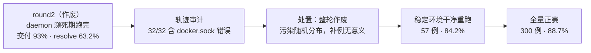

# 全量 300 例 88.7%：harness9 打榜 SWE-bench Lite 技术报告

## 关于 harness9

harness9 是一款 Local-First、轻量级、功能完备、生产可用的通用 Go Agent 框架。

- **官网**：[https://zhangshenao.github.io/harness9/zh/](https://zhangshenao.github.io/harness9/zh/)
- **GitHub**：[https://github.com/ZhangShenao/harness9](https://github.com/ZhangShenao/harness9)

⭐ Star 是对开源工作最直接的支持，欢迎提 Issue 和 PR。

---

## TL;DR

- harness9 + 开放权重模型 moonshotai/kimi-k3 全量跑完 SWE-bench Lite 300 例：**266 例解决，88.7%**，Wilson 95% 置信区间 [84.6%, 91.8%]。每个数字都能在公开 artifacts 里对账。
- 全程 pass@1 严格单次采样：模型行为结果从不重跑。唯一一次重试是基础设施故障（sympy-13146 的 provider 流在 turn 58 中断），重试后仍未通过，如实保留为失败。
- "不用 web 查答案"不是口头承诺：docker `--add-host` 把 6 个 GitHub 域名钉死到 0.0.0.0，容器内 DNS 即拒，PyPI 自举通道不受影响。
- 34 例未解决逐一归因：32 例模型层失败 + 1 例官方评分器自身的确定性报错 + 1 例 30 分钟超时的空 patch。
- 一轮 daemon 污染的校准成绩（63.2%）被整轮作废：patch 交付率 93% 不等于质量。这个教训被固化成评分前的强制审计工具 audit_run_health.py。
- 正赛推理成本 $485.29，墙钟 11 小时 22 分；全战役约 $710。系统开源 MIT，一条命令可复现。

## 本文你将学到

- 你将看清这次打榜的完整口径：模型、成本、时长、采样纪律与置信区间。
- 你将理解容器级反污染怎么做到"想查也查不到"，而不只是"答应不查"。
- 你将掌握 88.7% 的构成：12 个仓库的成绩分布，与 34 例失败的真实归因。
- 你将看到一轮 63.2% 的成绩为什么被主动作废，以及"交付率 ≠ 质量"的审计门控怎么建。
- 你将拿到从零复现这次运行的命令与 artifacts 入口。

## 结果先行

先给结论。SWE-bench Lite 全量 300 例，**266/300 = 88.7% resolved**，Wilson 95% 置信区间 [84.6%, 91.8%]。

置信区间相当于给分数画一根误差棒：换一批同等规模的采样，真实水平大概率落在这个范围里。这次跑分不是孤注一掷——此前 57 例校准先导拿到 84.2%（CI 72.6%–91.4%），全量结果正落在校准区间内，说明子集到全量的外推是有效的。



账单和时钟也一并交代。正赛推理成本 **$485.29**（input 136.5M tokens / output 5.05M tokens），墙钟时间 11 小时 22 分（2026-09-13 05:31–16:53），3 路并发。算上校准阶段约 $225（含作废的 round2），全战役约 **$710**，落在 $800 预算内。

模型是 moonshotai/kimi-k3——开放权重，经 OpenRouter 调用，1M 上下文，$3/$15 每 MTok。harness9 不改模型权重，只提供运行时。这也是 harness 类提交的边界：分数属于"框架 + 模型"的组合，我们只对框架那一半负责，并且把它完整开源。

## harness9 是什么？

一句话：Go 语言写的开源（MIT）Agent Harness。模型负责想，harness9 负责让"想"落地成动作。

它提供标准 ReAct 主循环（ReAct Loop，即"想一想 → 动手 → 看结果 → 再想"的循环）、同 Turn 并发工具执行、双重上下文压缩、原生 Planning（PlanStore）、Sub-Agent 委派、Docker 容器级 Sandbox、OpenTelemetry 可观测，以及 token 级 usage 记账——这次打榜的每一分钱就是从记账里对出来的。

打榜场景下，每个实例的旅程是：宿主机 blobless clone 仓库并 checkout 到 issue 之前的 base commit → 起一个 Docker 沙箱 → Agent 用 bash / read_file / write_file / edit_file / plan_write 五个工具自主修代码 → 收集 `git diff` 作为 model_patch → 官方 harness（swebench 4.1.0，官方 amd64 评测镜像）注入隐藏测试判分。

Agent 看不到也拿不到隐藏测试。它手里只有 issue 原文和仓库代码，和我们平时接手一个陌生 issue 的处境一样。

## 一局怎么跑？

单实例配置全部亮出来：maxTurns=80、单条 bash 命令超时 300 秒、单实例 30 分钟预算、上下文压缩预算取模型窗口的 55%。3 路并发跑 300 例，就是那 11 小时 22 分钟。

有几个不是调参、而是从失败轨迹里长出来的护栏。比如收尾门槛：剩余 Turn 低于阈值时注入一次提示，要求立即验证再收尾——因为它出现过 pylint-7114 在第 80 轮刚改完就被截断、patch 处于未验证状态。

```go
// cmd/swebench/runner.go —— 引擎装配（节选）
engine.WithGenerateRetry(4, 2*time.Second),        // 瞬时 LLM 错误可恢复
engine.WithStallNudge(stallNudgeWindow, stallNudgeText),      // 打断只读空转
engine.WithPlanningGate(planningGateThreshold, planningGateText), // 探索过深先规划
engine.WithClosingGate(closingGateThreshold, closingGateText),    // 收尾前强制验证
```

这些护栏都作用于"发送给 LLM 的临时副本"，不持久化、不改判任何结果。它们影响的是 Agent 的工作质量，不是评分本身——评分永远由官方 harness 说了算。

还有一条容易被忽略的工程细节：收集 patch 前先 `git add -A -N`（intent-to-add）。新建文件默认不进普通 `git diff`，不做这一步，一个真实修复可能在提交评分前被静默丢掉。

## 怎么防作弊？

SWE-bench 的题目全部来自真实 GitHub issue，而上游仓库里就挂着答案。Agent 只要抓到对应 issue 的讨论或 commit 页面，分数就废了。

所以反污染设计（anti-contamination）的思路不是"答应不查"，而是把窗户钉死。先看名单：

```go
// cmd/swebench/runner.go —— v4 评测中 17% 实例的轨迹出现 GitHub 访问，
// 直接污染 resolve 率。DNS 层封禁后依赖自举仍走 pypi，不受影响。
var swebenchBlockedHosts = []string{
    "github.com",
    "raw.githubusercontent.com",
    "api.github.com",
    "codeload.github.com",
    "objects.githubusercontent.com",
    "gist.github.com",
}
```

封禁发生在容器层。Docker 启动参数里把这些域名逐一钉到 0.0.0.0：

```go
// internal/sandbox/container.go —— 容器内访问即刻连接失败
for _, host := range c.cfg.NetworkBlockedHosts {
    args = append(args, "--add-host", fmt.Sprintf("%s:0.0.0.0", host))
}
```

`--add-host` 改写的是容器内的 DNS 解析：域名直接指向 0.0.0.0，连接在第一步就被拒掉，Agent 想绕也没有路径。PyPI 通道不受影响，依赖自举照常工作。轨迹里可以复核：300 条轨迹中不存在任何对上游 issue / patch 页面的成功抓取。



红线逐条声明，这也是提交官方榜单的 checklist：

1. **pass@1 严格单次**：单 rollout，每实例只提交一份 model_patch，无 best@k、无多轮择优。唯一一次重试是基础设施失败——sympy-13146 的 provider 流在 turn 58 中断，按 infra 故障定点重跑一次（32m33s，407 字节 patch），评分仍未通过，如实保留为失败。模型行为结果从不重跑。
2. **不用测试知识**：数据集中的 FAIL_TO_PASS / PASS_TO_PASS / test_patch 字段在 runner 加载后不进入 Agent 可见上下文，隐藏测试只在评分阶段由官方 harness 注入。
3. **不用 hints**：hints_text 在 prompt 组装阶段被排除，Agent 从未看到任何 issue 评论。
4. **无 web 查答案，且有容器级防护**：见上文，机制在 `internal/sandbox/container.go`，轨迹可复核。

再加一道存证：评测启动时抓取 OpenRouter 公开元数据端点的模型信息，落盘为 `model_snapshot.json`——"这一轮由哪个版本的模型服务"，有据可查。

## 分数怎么构成的？

per-repo 成绩一览（resolved/总）：

| 仓库 | 成绩 | 比率 |
|------|------|------|
| pylint-dev | 6/6 | 100% |
| pallets（flask） | 3/3 | 100% |
| pytest-dev | 16/17 | 94% |
| django | 106/114 | 93% |
| matplotlib | 21/23 | 91% |
| scikit-learn | 21/23 | 91% |
| sympy | 65/77 | 84% |
| psf（requests） | 5/6 | 83% |
| astropy | 5/6 | 83% |
| pydata（xarray 等） | 4/5 | 80% |
| mwaskom（seaborn） | 3/4 | 75% |
| sphinx-doc | 11/16 | 69% |

django 的 106 例占了总盘子近四成，93% 的成色决定了大局。最弱的是 sphinx（69%），失败集中在环境漂移类——文档构建链对依赖版本敏感，沙箱环境与历史时点的偏差会放大到测试结果。

300 − 266 = 34 例没有解决。诚实分解如下：

- **32 例模型层失败**：与校准阶段一致的分布，sphinx 系环境漂移、astropy/matplotlib 顽固实例。
- **1 例官方评分器自身报错**：scikit-learn-13496，官方 harness 确定性抛出 `EvaluationError`。校准两轮加正赛，三轮独立评分签名完全一致——这是实例级的评测环境问题，与我们提交的 patch 无关。按官方口径计入未解决，我们不申请豁免。
- **1 例空 patch**：matplotlib-26011，单例 30 分钟预算耗尽。pass@1 纪律下如实计为未解决。

没人喜欢解释失败，但榜单的可信度恰恰长在这 34 例上：它们不是被藏起来的，而是被归因的。

## 63.2% 为什么作废？

讲这次打榜最贵的一课。校准阶段有一轮（round2，2026-09-11）赶上了 Docker Desktop daemon 周期性死亡。当时没人察觉，57 例照样跑完、patch 照样交付、评分照常进行——63.2%，看着不算灾难。

事后审计发现了真相：**32/32 条轨迹日志全部含大量 `failed to connect to the docker API` 错误**（每实例 7 到 62 次）。也就是说，Agent 的 bash 工具全程不可用，模型是在"盲写"patch——典型案例 django-14855 从 Turn 1 起所有命令都失败，模型依然凭想象交付了一份 patch。

patch 交付率 93%，resolve 率 63.2%。两个数字的落差就是污染的形状。

我们的处置是**整轮作废，而不是补例重跑**。理由很直接：daemon 死亡按实例随机分布，无法定点剥离哪些 patch 被污染、哪些幸存；留下任何一部分，都是在往分数里掺未知杂质。在稳定环境干净重跑后，同样的 57 例拿到 84.2%。



教训被工具化，而不是写进教训总结就完事。我们写了 `audit_run_health.py`：扫描轨迹日志中的 docker.sock 错误签名、校验轨迹覆盖完整性，正赛的 300 例在评分前先过这道门——不通过，不许评分。正赛审计结论：daemon 污染 0，轨迹覆盖 300/300。

这件事的通用结论只有一句：**patch 交付率 ≠ 质量**。任何"交付了就计分"的流水线，都该先回答"执行环境当时健康吗"。

## 怎么对接官方流程？

提交 SWE-bench 官方榜单走的是 SWE-bench/experiments 的公开流程，这次打得也比较规范：

1. **资格确认**：先在 [SWE-bench/experiments#482](https://github.com/SWE-bench/experiments/issues/482) 确认提交资格与口径。
2. **提交 PR**：实验结果以 PR 形式提交到 SWE-bench/experiments，本文即该提交所引用的技术报告：[SWE-bench/experiments#483](https://github.com/SWE-bench/experiments/pull/483)
3. **公开 artifacts**：全部预测（all_preds.jsonl，300 条）、per-instance 评分日志、推理时同步生成的人类可读轨迹（trajs，300/300）都在公开仓库，含 `model_snapshot.json` 存证与如实记录缺失项的 EXPORT_MANIFEST：[ZhangShenao/swebench-lite-20260913](https://github.com/ZhangShenao/swebench-lite-20260913)

轨迹是推理时同步生成的，不是事后补写——这一点官方 checklist 明确要求，也是审计能成立的物理基础。

## 怎么复现？

系统开源（MIT），复现路径全部公开：

```bash
git clone https://github.com/ZhangShenao/harness9
cd harness9
cp .env.example .env   # 填入 API Key，设置 LLM_MODEL=moonshotai/kimi-k3
./benchmarks/swebench/run-official-lite.sh --output <run 目录>
```

要点三条：

- **采样 seed 固定为 1**：同 seed 复现同一实例集，不是"跑个大概"。
- **一键脚本内置质量门控**：`audit_run_health.py` 在评分前强制审计 daemon 污染与轨迹覆盖。
- **model_snapshot.json**：评测启动时抓取的模型元数据快照，锁定"哪一版模型服务了这一轮"。

运行目录里会有 predictions、per-instance 日志与 trajs。用它们对账本文任何一个数字，是我们预期的用法。

## 结语

榜单上的一行数字可以写得更漂亮——前提是你愿意把不漂亮的 34 例、连同作废的 63.2% 一起摆出来。

下一次你看到某个 Agent 榜单分数时，不妨先问一句：轨迹公开吗？执行环境健康吗？重跑过模型行为吗？

